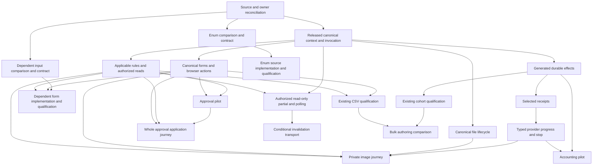

# Can capability orchestration

Coordinate the selected capability roadmap through bounded dependency packets and explicit contract handoffs. Existing compiler and package correctness work continues under its current owners. Start with source reconciliation, the real image-application execution path, and independent preparation of enum exhaustiveness and dependent forms. Promote reusable or conditional features only after their scoped evidence gates pass.

This is a proposed orchestration plan, requested on October 7, 2026. It builds on [the evaluation](README.md) and [per-proposal implementation plans](implementation-plan.md). Packet definitions, scheduling, ownership and acceptance appear below; current leases and task receipts must be refreshed before execution.

For individual work items and completion checks, see the [detailed 63-step sequence](task-sequence.md) and [structured task graph](task-sequence.json). These elaborate the packets below without assigning active authors or adding canonical jobs.

## Outcomes and first milestone

The first product milestone is a private image-generation journey authored in `.can`: create a job, submit it, see queued/running progress, inspect finalized output, handle failure or an unknown outcome, stop, reconcile and retry safely. The frontend must adapt to current authorized state while preserving unsaved input. Use the existing flat machines and polling, and prove the actual generated operation and provider path. A simulated receipt alone cannot complete this milestone.

Prepare two source improvements alongside that work: enum-only exhaustiveness and a dependent-input binding to an authorized read operation. Their implementation does not wait for the whole image provider programme. Each needs its own narrow execution/form seam, value comparison and shared-file handoff.

The next milestone is concrete approval and accounting reuse, with current-authority evidence and a proved transaction-owner mapping. Specialized invocation, judgment and corpus completion continues through its existing tasks. Bulk authoring reuses the accepted cohort design. Conditional presentation/calendar/transport work enters only when its recorded trigger occurs.

## Current work and ownership

The orchestration observation is pinned to committed `09a27206`; the earlier evaluation remains pinned to `4e89b117`. [Baseline and lease observations](orchestration-baseline.json) preserve that distinction. They are snapshots, not permanent leases or proof of current completion. Source/task inventory statements about stopped historical workers do not override the two currently active coding chats.

| Current owner | Observed active scope | Orchestration treatment |
| --- | --- | --- |
| Existing compiler chat | Compiler type/IR/emitter work, selected calls/defaults/formatting and session history | Reuse reviewed commits and explicit descriptor/context handoffs. Queue new grammar mutations behind the actual shared-file owner. |
| Existing package coordinator and its metadata author | State registry and Cloudflare invocation provenance/selected-read fixes; later fanout fix waits for that release | No new worker edits these files. A metadata repair is not a broad canonical result/replay API release. |
| Existing package coordinator | Git integration, run state and living file-tree records; bundle/provider candidates under independent acceptance | Keep its integration ownership. Provider cap/cancel-identity corrections are useful incoming fixes, not full generation/cancellation qualification. |
| This planning chat | Capability evaluation, plans and orchestration artifacts | Preparation and independent review only in this turn. The short decision append was completed and its shared-file lease handed back. |

Refresh these observations before each packet. A quiet chat, an expired timer or a clean-looking worktree cannot release another writer's files.

## Working arrangement

Use one coordinator to maintain readiness, request narrow owner handoffs, reconcile reviews and arrange integration. Keep the two existing coding chats on their authorized scopes; they are incoming producers and defining owners, not extra workers to reassign without a handoff.

Within this chat's four available slots, retain the coordinator and use up to two authors plus one independent reviewer. Another chat's agents have their own reported capacity; do not treat the app as a single shared pool of four. When shared files are unavailable, use author capacity for complete app comparisons, independent failure vectors or an unrelated released packet rather than duplicate fixes.

Use the [model-selection policy](/Users/vince/.codex/skills/model-selection/SKILL.md): Sol medium for normal bounded implementation and review; Sol high for cross-file contracts or uncertain failures. Luna light/medium fits repeatable inventory and receipt checks with an established rubric. Use Astra for an actual difficult or consequential authority/recovery decision, rather than every packet. Existing reviewed compiler/package work retains its own allocation. Model costs and task durations are not measured here.

An author owns one bounded vertical slice at a time. A reviewer receives requirements, raw source/diff, contract and independent expected results without the author's verdict. The coordinator, not the author, records acceptance. Disjoint authoring and review can overlap; shared schema/IR/runtime mutations cannot.

## Waves and dependency flow

Waves describe priority, not global barriers. A ready narrow packet may proceed while an unrelated earlier packet remains open.

| Wave | Work | Exit condition |
| --- | --- | --- |
| 0 | Reconcile current source, task credit and file leases; choose exact app/witness sources; inventory released contracts | Every scheduled slice has an integrated base, supported types, owner, independent expected results and explicit remaining gaps |
| 1 | Finish canonical context/invocation, applicable rules/read fences, ordinary forms, durable effects, selected receipts/progress and files; prepare match/dependent-form comparisons | Narrow producer contracts pass their own generated-path tests and are released to consumers |
| 2 | Qualify the private image journey; implement bounded match and dependent forms when their own gates pass | Complete lifecycle/failure UI works at the promised storage/provider scope; each source addition passes its separate value and vertical acceptance |
| 3 | Approval/accounting pilots, concrete cancellation/deadline and recovery protocols; existing protected invocation/judgment/corpus joins | Reuse preserves domain rules, current authority, transaction ownership and durable uncertainty; specialized tasks close only their actual slices |
| 4 | Qualify existing cohorts/CSV, compare a thin bulk surface; conditionally admit wizard/view/calendar/flat-reuse/push work | Required measurement or repeated-use witness demonstrates value over the complete existing alternative |
| 5 | Integrate affected original app, durable upgrade and installed-release evidence | Per-app and release scopes are independently verified; broader original parents close only when their complete original acceptance passes |

The enum branch uses the smallest already available compiled local-scenario seam; it does not require all context, form or provider cases. Dependent lookup uses only its authorized read/form scopes. Image progress is not a prerequisite for unrelated payment recovery or judgment execution; those use their own released provider contracts. Read-only partial/polling qualification is separate from canonical forms, so a push pilot inherits only the interface behavior it actually uses.

## Bounded work packets

Packet IDs below are scheduling labels. [The machine-readable plan](orchestration.json) records their dependency graph, conditions, ownership groups, canonical references and handoffs. It is an overlay on the existing task ledger, not another count of canonical implementation jobs. Preparation, implementation, qualification and reconsideration are distinguished.

| Packet | Scope and prerequisites | Deliverable and bounded completion |
| --- | --- | --- |
| O0 | Source, evidence and lease reconciliation | Exact integrated base; preserved accepted slices; current foreign owners; registered original app/operation hashes; an actionable list of missing joins. Historical ledgers do not supply live readiness. |
| O1 | Narrow producer/consumer contract inventory after O0 | Named schemas/identities, scope context, current-authority/read fences, one-owner transaction, durable effect/receipt/file semantics and compatibility. Identify which already exist; only missing contracts require design work. |
| F1 | Canonical compiled invocation/context; T04/T15/T16/T17 and FP.CONTEXT | One real compiled operation reaches loader, admission and durable state with verified actor/team/clock/operation, defaults, versions, replay and restart. Denied/stale/wrong-owner/actor-null controls pass for the selected scope. |
| F2 | Applicable rule/read slices after F1; T31/T32 and SM.QUALIFY where used | Provisional reads, required hooks/locks/invariants, current membership fences, managed-field protection, one commit version and rollback on the selected workflows. Do not make an unrelated secondary-hook profile mandatory. |
| F3 | Ordinary canonical forms after F1; T19/T20 and FP.BROWSER | An actual emitted scalar/reference form plus bound-record action reaches identical canonical browser/MCP admission. Assets, CSRF/context, versions, validation, replay, focus and pending edits work. Files are added only when F7 is released. |
| F4 | Generated durable effects after F1; T24 | A compiled bound send and keyed timer reach the actual durable dispatcher. Domain/history/replay/outbox/schedule commit together; later failure emits nothing; restart and dispatch guards preserve identity. Required source predicates/rules need their specific F2 slice. |
| F5 | Selected associated receipt observation after F4; T25 | Populated current membership, exact selected disclosure, status-only grants, receipt revision fences and stale association work through an actual installed/bundled consumer. Reuse accepted observer/kernel slices. |
| F6 | Provider progress and targeted stop after F5; T26 and applicable provider tasks | Original-operation/source/revision/sequence, duplicate/out-of-order events, terminal outputs, unknown acceptance, late verified usage, stop-success race and restart qualify. Provider corrections alone do not close this packet. |
| F7 | Canonical browser/MCP file lifecycle after F1's durable owner boundary; FP.FILES-DURABLE | Actual finalized bytes/digest/provenance, authorized references, failed/expired/foreign transfers, replay and retention. Preserve the original T24 file-specific durable handoff; a generic transfer need not wait for F4's compiled send/timer witness. Provider finalization separately consumes F6 under T27. |
| J0 | Private image journey after the matching F1–F7 slices; T37/FP.QUALIFY and SM.QUALIFY aliases | Pinned `.can` source executes the declared generation lifecycle and negatives through real browser/MCP/durable/provider paths. Include unknown/stop/reconcile/retry, two actors and revoked output disclosure. Review/publish is joined only when included in the selected original app's declared workflow. |
| V0 | Authorized read-only page, partial delivery and installed polling after F1 context and F2 read outputs | Actual emitted read-only page uses current row/field admission, mounted assets, context/sequence fencing, revocation/logout/navigation/hidden-page behavior and restart. No scalar form or bound-action qualification is required for this output. |
| N8 | Enum exhaustiveness; preparation after O0, implementation after value/contract/owner gates | Three complete before/after finite handlers; compare stronger conditional coverage with enum-only match. Added cases force review, intentional fallback stays valid, subject runs once, branch effects/rollback hold. One compiler owner integrates syntax/checker/IR/emitter/tooling. |
| N9 | Dependent form binding; preparation after O0, implementation after selected F2/F3 slices | Typed existing authorized read operation takes sibling canonical inputs and returns bounded compatible candidates. Compiler descriptor, interface lookup and browser invalidation agree. Delayed responses, revoked candidates, cleared child selection and final eligibility checks pass. No arbitrary browser expressions or new input schema. |
| D4 | Approval pilots after selected F1/F2/F3 slices; FP.INVOCATION only for protected call approval | Concrete expense and image revision reviews freeze evidence and prove reviewer/quorum/rejection/expiry policies, concurrent/duplicate votes and stale/revoked evidence. Compare ordinary package/template/duplication before extracting an API. Publication remains separately authorized. |
| J1 | Complete approval application after D4 and its actual invocation/rule/form/file/provider outputs; T37/FP.QUALIFY/FP.UPGRADE-JOIN aliases | A registered whole approval app executes all declared original workflows through compiled browser/MCP operations with meaningful reviewers, rejection/expiry/concurrency/revocation, durable restart/replay and stored/pending-work upgrade. Inline protocol pilots do not substitute for this route; conditional file/provider dependencies follow the selected app. |
| D5 | Accounting ownership/value preparation after O0; implementation after relevant F1/F2/F4 plus verified usage | Image/token allowance and concurrency-slot pilots prove same-owner admission or explicitly staged recovery. Cap races, overflow/units, duplicate settlement, unknown commitments and late usage pass. Release pure helpers before a shared mutating API; monetary caps need enforceable pricing evidence. |
| D2 | Cancellation/deadline pilot after F4 and applicable F6 provider stop | Current attempt keys, pending-dispatch suppression, targeted accepted cancellation, timer replacement, duplicate event, late success and unknown cost survive restart. Extract coordinator only after a second actual consumer repeats the policy. |
| D3 | Explicit domain recovery after F4/F5 and the chosen provider's definite effect/reconcile contract | Record recovery eligibility, current authorization and stable request identity; distinguish failure and uncertainty of recovery itself. Crash/duplicate/rejected/irreversible controls pass. Payment reversal additionally consumes FP.AW-PAYMENTS; it does not wait for image progress. |
| X16 | Existing reviewed invocation completion; FP.INVOCATION and F1/F2/F3 selected scopes | Exact normalized arguments/ref versions/provenance, readable protected preview, current target admission, approval+effects and post-call rollback qualify in actual Workbench targets. No string dispatcher. |
| X17 | Existing judgment completion; T12/T13/T24 and FP.AW-JUDGMENT | Actual source rubric/version/static or runtime options reach provider/normalizer. Full distributions, option correspondence, numeric bounds and usage pass. Invalid output fails safely; advice grants no authority. |
| X18 | Existing corpus completion; FP.CORPUS and its original dependencies | Source lifecycle/index withdrawal and opaque answer reach authorized UI/MCP disclosure. Every supplied source, including uncited context, is rechecked; revoked/withdrawn/superseded evidence withholds correctly. No plain-text or provider-input escape. |
| B6 | Existing cohort and CSV qualification, then thin bulk comparison; T33/T34/FP.CSV | Reuse the accepted cohort decision and all original boundary/race/restart/fairness vectors. Preserve reviewed CSV invalid/excluded rows, consent, order and per-row outcomes. Add a thin derived surface only if complete-source comparison demonstrates benefit. |
| C7 | Conditional calendar helpers | Two matching calendar consumers justify versioned timezone/holiday/next-occurrence policy. Pure calculation and independent DST/month-end vectors may precede durable scheduling; scheduler witness waits for F4. No recurrence grammar. |
| C10 | Conditional wizard presentation | One demonstrated multi-session consumer, explicit private draft/save/submit policy and selected F3/file/persistence seams. Resume/conflict/expiry/discard/final replay pass. Step navigation does not execute final business work. No inferred draft store. |
| C11 | Conditional named views | A repeated custom subtree survives existing defaults. Typed arguments/action bindings, lexical isolation and cycle rejection qualify. Read-only reuse needs only rendering; action-bearing reuse additionally needs F3. Controls and draft identities cannot collide. |
| C13 | Conditional shared flat-machine reuse | Two qualified models repeat stable state/default vocabulary or graph structure. Start with the smallest useful sharing; operation edges/permissions remain canonical. Persisted states, creation defaults, bypass protection and upgrades pass. |
| C14 | Conditional push invalidations after V0's authorized partial/polling outputs | Installed polling measurements miss a stated latency/load target. Postcommit hints plus current authorized rereads beat the same workload. Disconnect/reconnect/revocation/hidden/context/backpressure cases pass; no mutation resubmission or row-value stream. Read-only push does not wait for F3; preserving editable forms additionally consumes its relevant output. |
| H12 | Deferred generic-package reconsideration only | Two working ordinary packages prove concrete imports/templates insufficient. Settle nominal constraints, instance IDs/owners, role substitution and migrations with fresh advice before any grammar assignment. |
| H1 | Deferred durable-await reconsideration only | Two qualified complete compositions retain costly continuation bookkeeping after reuse. Compare equal business evidence/history, crash/unknown/authorization/upgrades. Start with sequential bounded continuation only if earned. |
| H3 | Deferred compensation-grammar reconsideration only | Two real recovery protocols establish repeated semantics. Settle definite-success registration, crash gaps, separate authority, ordering and uncertain recovery before any source effect. |
| H13 | Deferred richer-statechart reconsideration only | A real nested/parallel workflow demonstrates a simpler complete representation than qualified flat machines. Settle target resolution, conflicts, entry/exit/history/order and migrations together before implementation. |

For every packet, use the per-proposal plan's full acceptance and the original task's complete acceptance at its declared scope. This table does not replace them with shorter checklists. The JSON names required outputs on each dependency edge and conditional outputs separately. A consumer waits for those exact accepted outputs, bound to the selected app/operation/type/backend, rather than the whole producer packet. Original canonical prerequisites remain in [the reference crosswalk](orchestration-canonical-references.json); each narrow release still needs defining-owner acceptance. Generic file transfer, read-only push, enum handling and calendar calculation do not inherit unrelated feature prerequisites.

## Contract and file handoffs

Producer handoffs include the integrated commit and source digests; exact supported schema/types and canonical IDs; relevant actor/team/clock/operation context; permission/read-fence/owner rules; replay, unknown result, file/lifetime and upgrade behavior; independent positive/negative vectors; commands and raw receipts; known baseline failures; and the next owner. A source sketch or unreviewed dirty patch is not a handoff.

For new semantics, prepare a complete equivalent comparison first. Consequential unresolved choices require three independently worded equivalent JEV consultations using verified context. Prior JEV advice is reused only at its recorded scope. Design advice alone cannot release code or mark a runtime join complete.

| Serialized ownership group | Shared paths or surfaces | Ordering rule |
| --- | --- | --- |
| Compiler language and emission | Syntax/CST/parser, resolution/type/effect analysis, IR/JS/artifact and editor/formatter/lint support | Existing corrections first. N8 and N9 may prepare together; their shared-file implementations have one writer and queue by ready contract. Rebase/review each integrated result. |
| Public descriptors/contracts | Artifact, presentation, state/provider/corpus canonical schemas | A defining owner releases compatibility and capability/version behavior before consumers join. Older runtimes must not silently ignore required semantics. |
| Canonical runtime/state | Cloudflare invoke/context/artifact/assembly, State registry and mutation pipeline | Metadata and pending fanout owners retain current leases. New foundation/domain features consume or request narrow changes; no parallel rewrite of the invocation seam. |
| Forms and partial rendering | UI forms/controls/bootstrap/polling; HTTP presentation/actions; lookup and CSV boundaries | F3 releases stable identities/context first. N9, wizard/action-bearing views and push queue shared changes. Isolated fixtures can prepare independently. |
| Work/provider/file integration | Dispatch registration, schedule/receipt/progress, provider adapters, file finalization and bundle assembly | Separate pure helpers/vectors can overlap. Release original target identities and durable semantics before claiming provider execution. |
| Shared records and Git | DECISIONS, grammar/design, task evidence, living file-tree and shared index | One named integration owner stages/commits. Workers submit exact diffs/receipts; no full-file staging of foreign notes. Checkpoint advances only after complete required review. |

Worktrees isolate working changes but do not solve semantic conflicts in shared files. At execution time, inspect existing attached worktrees, reuse a suitable checkout, or create an isolated `codex/` branch from the owner-approved committed base. Do not copy another worker's unaccepted changes into an allegedly clean baseline. Workers never reset/stash foreign work or take over the shared Git index.

## Dispatch and review loop

1. Refresh the committed source, relevant accepted evidence and current file owners. Resolve aliases to existing canonical tasks; credit their matching accepted work and schedule only missing slices.
2. Prepare disjoint comparison/specification/vector work immediately where useful. Mark unsupported sketches as proposed; do not add them as supposedly supported fixtures.
3. Release implementation only when the packet's exact prerequisite outputs, conditional value trigger, semantic contract and file handoff are present. Reserve the smallest write set. If any condition is missing, record that specific dependency and work on another ready slice.
4. Assign one economical author with a packet brief. Consumers may prepare against a released versioned contract before producer integration, but actual generated-path acceptance waits for the integrated producer and supported runtime.
5. Obtain independent review of the resulting diff and raw witnesses. Fix material gaps; do not rerun broad tests after a passing unchanged slice without a new reason. Authority, uncertain effects and upgrades receive review at the matching risk level.
6. The integration owner applies reviewed changes on the current approved base, runs affected checks, and creates focused Conventional Commits. Source/API activation stays gated until its consumer/runtime is supported. A narrow successful commit is not whole-feature acceptance.
7. Record accepted output scope, source pin, actual route, commands, outcome and remaining gaps. Wake only dependent packets whose required outputs now pass. On regression, withdraw the affected release and suspend its consumers; preserve durable work/unknown outcomes and unrelated accepted slices.
8. After every merge, its handling agent reconciles all changes since the living-plan checkpoint and updates coverage/decisions together. Do not advance the complete checkpoint merely because this feature or bookkeeping passed. Installed/native/original-app parents retain their full gates.

No recurring automation, deadline or background supervisor is created by this plan. Its initial machine state is planning-only with no assigned authors or active implementation leases.

## Packet brief and completion receipt

Each future assignment should state: “Complete packet ID for the selected operation/app at base SHA. Here are its defining owner, released contracts, exact allowed paths, independently expected cases, canonical task aliases, checks, exclusions and next consumer.” Include a bounded fallback task if its file handoff is delayed. Do not send workers the whole research history or an ambiguous request to finish the language.

The completion receipt contains:

- Packet and canonical task identities; integrated source/contract version; exact changed paths and file-lease handback.
- Actual source → compiler → loader/admission → runtime/storage/provider/interface route exercised.
- Independently expected positive/negative outcomes, command/raw evidence, and classification as unit, simulated provider, real durable, browser or installed evidence.
- Reviewer findings, corrections and remaining gaps; upgrade/capability treatment; reusable outputs and named next owners.

Acceptance states are `prepared`, `contract_released`, `implemented`, `scope_verified`, and `integrated`. Conditional/deferred items remain gated when their trigger is absent. Existing tasks can retain `partial` broad status while a named output is `scope_verified`. A missing dependency is not a reason to inflate progress or label a whole goal blocked.

## Qualification and stop conditions

Every packet tests the seams it changes. Source features need parser/checker/emitter behavior; canonical mutations need meaningful denied/stale/rollback/replay vectors; forms need live DOM and actual emitted submissions; durable/provider work needs crash/restart/unknown/late-completion evidence; schema changes need stored/pending-work upgrade behavior. A handbuilt descriptor, adapter mock or source trace is reported at that scope, not installed app acceptance.

The first image milestone passes only when all declared selected lifecycle behavior and required negatives work on its promised route. Wider original-app release additionally requires its complete intent ledger and relevant T37–T40/FP.QUALIFY/FP.INSTALLED-RELEASE evidence. Preserve native artifact-preparation HOLD and all existing backend/default/retirement gates. This plan cannot resume them.

Reconsider a candidate when complete-source savings vanish, it hides domain policy, its owner mapping needs forbidden atomicity, it duplicates an existing durable engine, or measured runtime benefit does not justify its cost. Record the reason and retain a working complete alternative. Do not expand match into exceptions/pattern programming, dependent forms into arbitrary JS, wizards into inferred persistence, or flat machines into statecharts during a bounded packet.

## First dispatch queue

When capability execution begins, the coordinator's first queue is:

1. O0/O1: refresh current handoffs and select the smallest real compiled app slices, consuming existing compiler/package commits.
2. Two independent preparation assignments: N8 finite-handler comparison/vectors and N9 typed authorized-read binding comparison/vectors. These can proceed without changing leased compiler/runtime files.
3. Release the first missing F1/F3/F4 producer slices to their defining owners, then advance their consumers F2/F5/F6/F7 as narrow contracts pass. Use free slots for approval/accounting ownership comparisons and original-app failure expectations.
4. Qualify J0 and the actual N8/N9 vertical paths. Continue D4/D5 and specialized existing joins only on their ready dependencies.

Calendar pure work and read-only view preparation can move independently when their triggers exist. Native installation gates, unrelated provider families and all 68 UI components are never artificial prerequisites for a narrower proven slice.

## Review and validation

[Independent review](orchestration-review.md) corrected unrelated file/push prerequisites and added the explicit whole approval journey. [Validation](orchestration-verification.json) checks all 21 proposal mappings, packet/output identities, strict and conditional dependency cycles, original canonical references, source hashes, links and local capacity. These are planning checks; no proposed product behavior was executed, no implementation workers were dispatched, and current coding-chat/Git ownership is preserved.

Recommended worker models and reasoning efforts for all 63 detailed tasks appear in [the allocation table](model-allocation.md) and each [task record](task-sequence.json). This remains proposed dispatch guidance.
