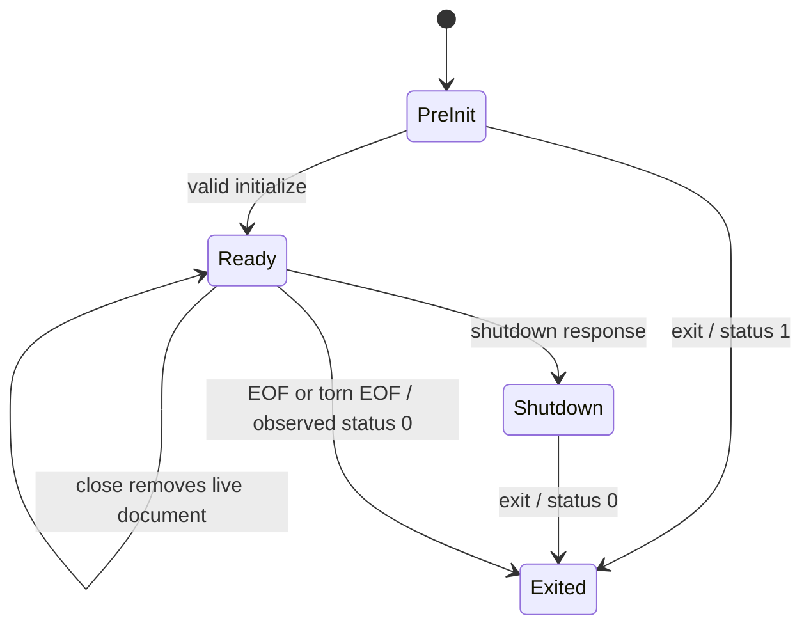

# Editor state and lifecycle — audit Step 11

The current editor has useful single-document behavior, but result currentness is not enforced by the actual client. Delayed diagnostics for older or closed documents are installed, and versioned rename results become unversioned editor edits. These are bounded correctness repairs. Long sessions retain historical source text and revisit it during linting. Cross-file analysis and per-root/catalog invalidation require a separate support decision; this audit selects no workspace engine or protocol framework.

This is an executed planning packet: 17 server duties and 14 client/consumer duties extend the existing [coverage ledger](coverage.jsonl). It does not implement repairs or complete the full compiler audit. All findings have defining writers, evidence and gates in [the packet registry](editor-evidence/registry.json).

## Pinned scope and qualification

[Inputs](editor-evidence/inputs.json) pin all 107 tracked compiler paths, governing contracts, actual editor source/tests, catalog and economical allocation. Start HEAD is `64e09759` (the manifest records the full revision); the compiler tree snapshot pin is `1fd07722090fe70228a6b661e3c6e136275ca84b`, and its last actual source change is `4ecd991a80ca025b6d5899ffdcea96075c60c25e`. All three compiler subtree hashes agree. Compiler/Cargo/editor/catalog inputs remain unchanged. Production compiler implementation stays 69,255 lines under the established classification; this audit adds evidence/documentation rather than implementation. It supplies no production-reduction receipt.

Root freshly built the locked, offline native library/binary and compiled the public observer against Cargo-reported libraries. The selected six integration harnesses have 99 passes; selected LSP unit tests have 29 passes, zero failures/ignored and 97 excluded unit tests. The existing freshly compiled startup test has 11 mock passes. There is no reported body skip in these selected outputs. Exact commands, hashes and raw streams are retained in [native execution](editor-evidence/execution.json), [process execution](editor-evidence/process-execution.json), [server options](editor-evidence/server-options.json) and [client execution](editor-evidence/client-execution.json).

Seventeen actual `can lsp` processes execute: eleven process-only sessions, two supported-option sessions and four processes driven through the freshly compiled, unmodified exported client/providers. Two CLI controls check valid source before comparisons. The actual-client seam uses selectively strict VS Code host stand-ins and controlled delivery of actual server frames. It qualifies module conversion and client state, not GUI rendering or actual edit application. The public long-session observer delegates to unchanged `RealAnalysis`; its 129 callbacks observe source storage directly. Source establishes historical parse/lint traversal; timings are observations, not a representative benchmark or RSS measurement.

Two reused Sol 6.1 medium workers map server/client duties and independently challenge each other's and root's evidence. No model escalation occurs. [Server review](editor-evidence/review-server.md), [process/resource review](editor-evidence/review-process.md), [client review](editor-evidence/review-client.md) and [245 verification checks](editor-evidence/outcome-verification.json) retain their limits. Verification succeeds when facts, controls and receipt hashes agree; it does not label the seven unmet contract groups as product successes.

## State and supported workflows

The server's normal stdio loop handles a frame, responds, drains diagnostics, then reads again. Requests and analysis are synchronous. Public delayed pumping is a separate call profile. `initialized` is accepted without another state gate; malformed initialization/envelopes do not enter Ready. The client sends required initialization fields, advertises diagnostic version support and uses full changes. Initialization timeout/failure and events during a delayed handshake remain source inspection leads, not newly reproduced startup failures.

| Boundary | Current supported behavior and actual witness | Limitation or unmet obligation |
| --- | --- | --- |
| Initialization/admission | Actual initialize succeeds; pre-init query gets `-32002`; selected admission suite exercises malformed bytes/envelopes and legal IDs | Client handshake gating, failed-init handling/timeout and parent-process monitoring lack new process witnesses |
| Open/change/save | Client-owned unsaved text; full synchronization; valid increasing versions publish diagnostics and repair clears them; opaque Unicode URI succeeds | Incremental changes are outside advertised full-sync support; save is a no-op. Equal/decreasing versions are invalid-client robustness, not mandatory rejection failures |
| Server result currentness | Synchronous queries use current document source; wire diagnostics and rename carry its version; stale public tasks with different versions are skipped | Same-version reopen can reactivate an old queued task, producing duplicate analyses of the new bytes; it does not publish old bytes |
| Client diagnostics | Current diagnostics translate; close deletes the collection locally; stop/death disposes it | Actual delayed version1 diagnostics install after document version2; delayed version3 publication reinstalls a closed document |
| Rename/actions | Actual rename wire edits carry version1; action conversion shares the inspected version-discard path | Delayed rename converted after document version2 has no version fence. No actual file edit or delayed action application is claimed |
| References/completion | Same-document references include declaration and use; actual completions include types, variables and keywords | `includeDeclaration:false` is ignored. LSP kinds7/6/14 are passed to VS Code whose corresponding values are6/5/13 |
| Cancellation | Synchronous server ignores pre/late cancel notifications without corrupting lifecycle | Cancelled hover provider still sends/offers a result and registers no token callback. No async server-analysis interruption is exercised |
| Close | Server rejects queries for closed documents; reopen starts a live document again | Bad-source close/barrier emits no empty diagnostic publication; bundled client deletion masks ordinary close, but late delivery defeats it |
| Shutdown/disconnect | Post-shutdown query gets `-32600`; shutdown/exit returns0, early exit1; clean/torn EOF returns0. Client cooperative stop sends shutdown/exit and drops later writes | Signal/write failures, stubborn-child timeout, host deactivation deadline and overlapping restart races remain unqualified |
| Restart/death | Manual extension restart shuts down old child and replays current version2/text to new real child. Death settles an undelivered response to null and calls onExit once | Undelivered means the server already answered but delivery was held; not interrupted server analysis. Crash recovery/configuration restart/catalog reload through GUI remain unqualified |
| Workspace/catalog | One catalog captured from environment/cwd at startup; both roots use it. Watch/config/folder notifications do not reload it; fresh process sees changed catalog | Bundled client launches one cwd-selected process, sends rootUri:null/no workspaceFolders, and has no catalog/folder watchers or per-document catalog switching |
| Cross-file | Valid joint CLI check resolves package export/import; opening both same files in LSP yields E2005 and empty cross-file definition | Each editor snapshot analyzes one source. No file closure, project references/rename, unopened-file loading or coordinated multi-root analysis is established |
| Long session | 96 distinct edits retain96 sources/791,031 text bytes;32 equal-text live changes retain those totals; close/reopen identical text gives97/799,271 | Source storage does not reclaim closed/history revisions; lint parses/lints retained history with current checked facts. Queue drains to0; no queue leak, historical typechecking, RSS/crash or workload benefit is claimed |

The official [LSP reference contract](https://raw.githubusercontent.com/microsoft/language-server-protocol/gh-pages/_specifications/lsp/3.17/language/references.md) defines `includeDeclaration`; [WorkspaceEdit](https://raw.githubusercontent.com/microsoft/language-server-protocol/gh-pages/_specifications/lsp/3.17/types/workspaceEdit.md) distinguishes negotiated `documentChanges` from plain `changes`. Both real option sessions emit `documentChanges`, even when support is absent; the bundled converter tolerates the carrier, so interoperability and edit currentness are separate findings. The official [single-file diagnostic guidance](https://raw.githubusercontent.com/microsoft/language-server-protocol/gh-pages/_specifications/lsp/3.17/language/publishDiagnostics.md) supports clearing on close. [VS Code1.91 public declarations](https://raw.githubusercontent.com/microsoft/vscode/1.91.0/src/vscode-dts/vscode.d.ts) provide the independent completion enum and document-version expectations.

## Bounded repair and qualification sequence

All nine packets below are **proposed**, with no implementation/API/dependency choice. Shared defining files have one writer or sequential release. Economical default is Sol medium for implementation/independent technical review, low for released mechanical fixtures; escalate only an unresolved consequential decision. Existing JEV advice selects none of these APIs. New consequential retention/workspace policy needs verified-context consultation under AGENTS.md; ordinary existing-contract repairs need no new policy choice.

| Packet | Exact defining writers | Retirement/acceptance target | Gate and priority |
| --- | --- | --- | --- |
| ED-R01 Diagnostic currentness | `editors/vscode/src/client.ts` | One authoritative live-document revision/epoch state; discard obsolete and closed-document publications; retain valid repair clears/reopen | Immediate client correctness; qualify actual client and GUI outcome without adding a parallel version registry |
| ED-R02 Provider edits/cancellation | `editors/vscode/src/extension.ts`, shared client seam through its writer | Honor document versions/cancellation before returning edits/results; preserve Unicode ranges and current rename/action behavior | Immediate edit correctness; actual host apply/no-apply witnesses required; avoid separate stale-result policies per provider |
| ED-R03 Completion API identity | `editors/vscode/src/extension.ts`, ambient declarations in `client.ts` | Remove assumed numeric equivalence and copied incorrect kinds; actual type/variable/keyword host kinds agree | Small independent correctness repair; any shared type/dependency adoption needs complete-profile comparison |
| ED-R04 Server close publication | `compiler/src/lsp/server.rs`, typed output seam | Publish intended empty diagnostics on close while cancelling closed queued work; ordinary client local clear and late delivery remain separate | Existing single-file close contract; qualify real protocol plus actual client |
| ED-R05 Supported reference/edit options | `compiler/src/lsp/server.rs`, `lsp/output.rs`, `ide/queries.rs` as needed | False excludes declaration; retain references order/use identity; negotiate workspace-edit carrier and preserve current versions | Existing supported option contracts; references and carrier can release separately, serialize common server writer |
| ED-R06 Session history ownership | `compiler/src/lsp/server.rs`, `source.rs`, `lint/driver.rs` | Bound session-owned retained revisions and stop reparsing unrelated historical snapshots; maintain valid immutable IDs/checked cohort and closed behavior | High maintenance/resource priority; measure representative edits and release ownership policy before choosing storage/reclamation API |
| ED-R07 Workspace/cross-file/catalog support | `compiler/src/lsp/server.rs`, `ide/queries.rs`, editor client/extension and support docs | Explicit declared supported closure/root/catalog lifetime; validate only selected scope against CLI and actual consumers | Qualification/policy gate, not automatic framework or all-workspace implementation; review advertised project-reference contract |
| ED-R08 Public queued epochs/shutdown | `compiler/src/lsp/server.rs` | Closed/reopened epochs cannot revive earlier queued work; shutdown prevents public pump publications | Public batching robustness; normal stdio already drains each frame. Do not claim asynchronous background executor defect |
| ED-R09 Startup/host lifecycle qualification | editor client/extension, existing startup/process tests | Exercise delayed/error initialization, timeout, overlapping restart, crash-reopen, stubborn shutdown and failed writes; classify supported expectations first | Source leads only; no new observed failure or automatic need for reconnect machinery |

Library simplification belongs to the complete caller closure. Copied host/protocol types and custom correlation/conversion need review, but this audit does not adopt a client framework merely because defects were found. Existing compiler `lsp-types` output is useful; it does not supply document lifetime, catalog ownership or correct client conversion. Measure production removal across the complete packet and retire superseded state/adapters; do not leave duplicate fallback engines. Correctness gates take precedence over a cosmetic line reduction.

## Evidence corrections and remaining scope

The first audit observer omitted required initializer fields; dependent queue/catalog/cross-file conclusions were invalid, and its own retention unwrap panicked. Its first package fixture was also malformed. [Original streams/scripts](editor-evidence/attempt1/) and [corrections](editor-evidence/observer-corrections.json) preserve those failures. Corrected observers assert successful admission and a clean CLI control before downstream claims. An intermediate Python indentation failure occurred before process execution. These are observer errors, not compiler defects. Integration validation separately corrected assumptions about ledger record/ID namespaces and snapshot versus last-source commit; no source changed. The independent client reviewer also corrected completion argument order and restricted the host stand-in and death claims; final receipts use the correct order.

The 31 duties are finite source/caller coverage, not every protocol branch or public precondition. Remaining gates include handshake/error/race and cancellation scheduling, actual GUI edit/diagnostic behavior, parent/signal/write failures, cross-file support policy, memory/latency workload qualification, other hosts and full final-release/installed-original application acceptance. Broader audit Step9 and Steps12 onward remain proposed. No compiler/editor/package source change, merge or living-plan checkpoint advance occurs; the canonical [living plan](../../../ideal-filetree-plan.md) retains its existing checkpoint.
