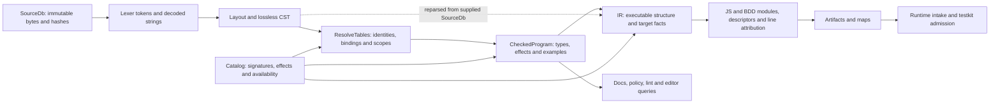

# Representations and authoritative owners — audit Step 5

The [single coverage ledger](coverage.jsonl) now maps 35 stage/boundary duties, eight selected carrier groups and all 18 existing workflow routes. Each stage row identifies defining declarations, authoritative facts, conversions, reconstructed work, source/catalog preconditions and evidence limits. These are responsibility slices, not an exhaustive list of every type or semantic rule. [Independent review](representation-review.json) distinguishes stage-specific information from duplication and qualifies the public-input witnesses below.

Compiler source remains `1fd07722090fe70228a6b661e3c6e136275ca84b`; the collection head is `2e8db234`. The ledger pins 37 supporting source/contract/probe inputs; the probe additionally records 108 unchanged compiler/catalog inputs. [Validation](representation-validation.json) checks the complete prior inventory, new anchors/joins/pins and saved evidence. Source/dependency/API behavior is unchanged.

The CST-to-IR reread is documented. The implementation also reconstructs some name, member, argument and type decisions, so the diagram does not imply that every downstream semantic fact is already published by analysis. Editor snapshots independently rebuild parse/resolution results; docs and lint reparse their supplied source sets.

## Fact authority and necessary representations

| Fact / ledger family | Current defining authority | Conversion and preservation obligation |
| --- | --- | --- |
| Source bytes, revisions, spans: FE-01, PRV | `source.rs`: immutable `Source`, database-local IDs, exact hashes and byte spans. | Adding a path creates a fresh ID; old IDs retain old bytes. IDs/spans contain no database-session seal. Line indexes need the matching text. |
| Lexical values and recovery: FE-02–04 | `syntax/lexer.rs`: decoded token values/errors; `layout.rs`: layout and description transformations; `cst.rs`/parser: lossless recovered tree. | Authored spelling and decoded value carry different information. Preserve exact source attribution and invalid/missing distinction; do not recreate a source decoder downstream. |
| Declaration/use identity: FE-05/06 | `analysis/resolve.rs`: `ResolveTables` with modules, symbols, scopes and per-use bindings. `NodeKey` joins process-local source nodes. | `CheckedProgram` retains modules/symbols, drops resolution scopes/bindings and clones selected facts. IR rebuilds indexes/import/name lookups; editor queries resolve again. |
| Types and checked behavior: FE-07–10 | `analysis/types.rs`, `effects.rs`, `examples.rs`: contextual types, authority/handler/model/rule facts, fixtures and behavior tables. | Catalog `SigType`, checked `ResolvedType`, `IrType`/`TypedExpr`, wire type IDs and runtime descriptors answer different questions. Similar fields alone do not justify merging them. Absence from `node_types` is not proof a position was checked. |
| Builtin profile/binding: LOW-05, PRV-03 | Catalog signatures/effects/availability; analysis `call_builtin`/`try_overload` own checked overload choice. | Analysis chooses type-compatible highest specificity, with catalog-order ties. IR separately chooses first matching arity for named argument order and derives awaiting from the supplied catalog. No winning per-call binding fact crosses this join. |
| Executable structure: LOW-02–07/11 | `codegen/ir.rs`: typed expressions, statement/effect order, scopes, UI/pages and suites; shared JS emitter plus BDD target. | These encode execution/context/attribution unavailable in schema-only types. Closed literal/member/sequence type rules and call-target reconstruction overlap analysis duties and need parity review. |
| Descriptor and wire projections: LOW-08–10/14 | IR declarations feed JS runtime metadata and artifact intake DTOs; operation descriptors are produced once. | Rich emitted model definitions and narrower execution descriptors overlap but have distinct contracts. Exact values/default kinds/null/omission matter; public fragment adapters also carry current support obligations. |
| Migration admission/digest: LOW-12 | `analysis/migrate_check.rs` checker, called by IR before emission; checked effects supply source structure. | This is the only current production admission call, not a repeated full-check pass. Runtime old-schema lineage remains another owner; directive digest spelling has separate authority. |
| Generated coordinates/maps: LOW-13 | `JsWriter` owns output text/push attribution; `source.rs` owns byte conversion; `sourcemap.rs` adapts/encodes maps. | Generated line attribution, original byte coordinates and source/name IDs must remain coherent. A push can contain embedded newlines; its vector entry alone does not establish physical-line alignment. |
| Reports/editor/fixes: LOW-15–17, PRV-05 | Checked facts and source slices feed docs/policy/lint; private `Snapshot` borrows source/catalog and owns its query facts. | A report revision/hash or document version describes its supplied carrier. It does not independently validate coherence with separately supplied checked facts. Static explain and opaque platform forwarding introduce no new checked facts. |
| Actual consuming boundary: LOW-18/19 | State registry validates artifact descriptors and derives interim execution tables; testkit decodes recipes/dependencies/users/rows. | External input admission and runtime structures are real duties. Cloudflare policy transcription and testkit construction are not automatically a second unnecessary compiler. Package ownership and incomplete platform/test joins remain explicit. |

## Observed reconstruction and normalization

| Lead | Actual work | Qualification before consolidation |
| --- | --- | --- |
| Parse/resolve results are dropped or rebuilt | `Snapshot::analyze` parses, calls full checking which parses again, then resolves again. IR parses every registered DB entry; docs reparses selected files; lint reparses DB entries. | Publish/reuse only facts belonging to the same source/catalog cohort and required source closure. No workload, CPU, memory or production reduction was measured. |
| Formatting has a second lexical working view | Formatter parses for admission, then lexes for physical-line formatting. | The second view supplies layout work, not proof of a redundant parser. Lossless and declared byte policies remain required. |
| Semantic call/name/type decisions recur | IR rebuilds member/import/name lookup, builtin classification/awaiting, named argument order and closed fallback/sequence types. | Current IR documentation's narrow reread principle is broader in implementation. No blanket parity proof, current overload counterexample or revised binding policy is claimed. |
| Decoded string fallback differs | Types/IR require lexer payload; effects/examples have distinct missing-payload raw recovery. | Invalid source does not always appear as `BadToken`. No clean parser-built corruption is established; source error gates remain. Hand-built/recovery preconditions need qualification. |
| Defaults and compatibility helpers cross text twice | Typed literal → compact fragment → `RawValue`; public docs `Json` views serialize then parse, while production docs serialize directly. | Required value/schema behavior differs from representation/API support. This is a concrete Step 6 integration lead, not deletion authorization. |
| Identity/presentation normalization repeats | Signature parsing, description joining, source-slice trimming, portable path revision framing, URI display conversion and type-ID formatting occur at distinct boundaries. | Some transformations intentionally serve different identities/displays. Trace owning rules and full callers before sharing or removing them. |

## Source/catalog coherence witnesses

The [saved public-API probe](representation-evidence/provenance/probe.rs) uses actual `CatalogAnalyzer::analyze_owned` and `EmitOptions::new`, with complete clean analysis; no test-only bypass. Eight emission cases pass. Assertions independently specify literal values, hash differences, awaiting changes and model association. The [receipt](representation-evidence/provenance/receipt.json), raw output, catalog variants and artifacts preserve actual results.

| Witness | Observed result | Meaning |
| --- | --- | --- |
| Coherent control versus foreign DB with identical IDs/spans | Checked `OLD` becomes emitted `NEW`; artifact hashes the newly supplied bytes while the supplied diagnostic result retains the old hash; no mismatch rejection. | Database-local keys do not seal public checked facts to a database/revision. |
| Immutable append control | Registering `NEW` under the same path preserves `SourceId(0)` and emits `OLD`; artifact source list includes both revisions. | Append-only identity works. Latest path revision and analyzed/emission source closure are separate questions. |
| Different catalog version/content | Altering `lower` from pure to state-read adds emitted awaiting. A major-7 catalog still leaves requirement minimum 0 from the checked catalog label. Same-version changed content also changes awaiting. | Label and consumed catalog content are independently supplied, without mismatch enforcement. This is deliberate mixed input, not evidence of wrong coherently rechecked catalog behavior. |
| Foreign DB with swapped file numbering | Old identities remain; `One.Thing` receives `TWO` and `Two.Thing` receives `ONE`; no emission errors. | Source numbering is part of the checked cohort. |
| Same DB, reversed check-file list | Module order becomes `Two, One`, with no diagnostics. | Caller tree order controls allocation; documented file/span ordering needs its precondition clarified. This differs from replacing the DB. |

Normal CLI owned analysis retains and passes the original DB/catalog/result/program, with analysis and emission shipping gates. Private snapshots borrow one DB/catalog and construct their facts together. The executed mismatches demonstrate low-level public-input hazards and missing coherence enforcement; they do not demonstrate normal CLI stale output. Docs' analyzed-source/success precondition is explicit; the exact low-level cohort/hash-equivalence contract still needs clarification. A future cache or reuse proposal must settle it first, without blocking unrelated adapters.

The first ordering fixture used invalid package-body grammar and the probe stopped with exit 101 after six successful cases. Its source, output and failure are retained. The corrected app fixture passes all eight emission cases. Initial fresh library build output was transcribed; subsequent raw locked/offline build verification occurred after the probes and confirmed unchanged library/input hashes. No later raw log is presented as a pre-probe rebuild.

## Remaining scope

Independent Sol 6.1 medium cross-review corrects source anchors, carrier fields, overload authority and migration timing, and adds actual runtime/testkit admission duties. Final integrated review accepts the bounded map and evidence after separating declared Rust fields from wire projections and clarifying execution/review scope. Luna 6 low supplies selected carrier/navigation facts; root handles source/catalog probes and the common ledger. The same-day [researched allocation](../model-allocation-20261007.md) is reused without escalation or a task-optimum claim.

Source/cohort support, missing checked binding facts, recovery/order preconditions and map push attribution are explicit later packet questions. No source/API/policy/dependency change, parser/library choice or cache architecture is selected. Existing Step 4 compatibility promises stay binding. Whole semantic/resource/oracle review, full consumer closure, generated-JS execution, installed/original-app acceptance, GUI and other-host qualification remain open. No merge or living-plan checkpoint advancement occurs.
