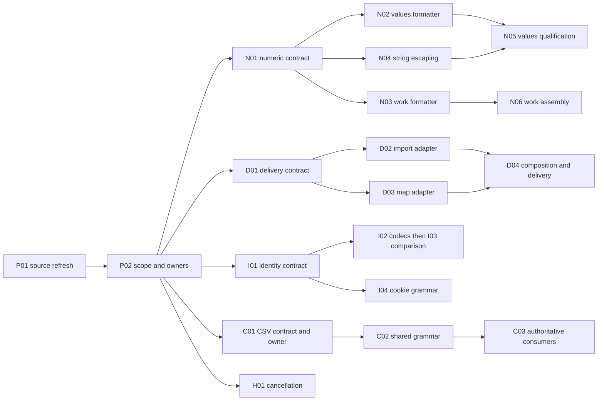

# Library adoption sequence within the existing Can plans

**Historical planning sequence with recorded finite implementation releases. Future execution remains deferred.** This sequence turns the [package audit](README.md) into finite work and acceptance units. It supplements the existing challenge, Rust-port and ideal file-tree plans; it is not a replacement master plan, a live assignment or a new canonical task count. The [machine sequence](adoption-sequence.json) records dependencies, candidate files and original-task references.

Source baseline: `309644a6881909d8dba32560bc6711f67e00a7ab`, with the package inventory and current remaining-work ledger as evidence. Refresh at actual activation. Keep credited results and their exact scope; fixes to credited source are corrective changes with affected requalification, not a redispatch of old work. `A03.1` is credited complete; `A04.5` is partial; `W04.1–W04.3` are `needs_verification`; `W04.4` is `not_started`. Standalone source/vector history does not establish compiled work-kernel acceptance.

There are **27 local units** below, including planning, conditional choices and repeatable review events. They are not 27 additional independent obligations on top of the existing 333-record remaining-work map. The machine namespace is `library-sequence:`; short labels here do not redefine the original R01 review or canonical port/product IDs. Crosswalk and selected scope must be reconciled before dispatch. Native preparation/native-release remains **HUMAN HOLD**. Identity/CSV/service/diagnostic changes need explicit finite scope in the selected future release; they are not silently added to a Rust worker's original packet.

## Scheduling and owners

**2026-10-07 human refinement:** execute future released packets with economical Codex subagents, not Muse instances. R1–R4 below are responsibility queues. Use Luna low/medium for clear routine work and Sol low/medium for technical packets; justify escalation. This dispatcher currently permits three subagents beside the root, so schedule across four queues within actual capacity. Codex alone stages released paths and commits coherent checked slices early and often. The [current execution policy](../../../implementation/RUST-PORT-EXECUTION-PLAN.md) supersedes the earlier Muse topology; implementation remains deferred.

The order is a dependency graph, not five global waiting waves. After P01/P02, each family can freeze its own version/contract and proceed. No family waits for all other library investigations. Preserve the existing original DAG and all narrow writer handoffs.

| Existing lane | Library work to interleave with original work | Boundary |
| --- | --- | --- |
| R1 — values assembly | Values portion of N01, N02, N04, N05; numeric evidence children on disjoint tests | Sole values Cargo/lock/module/binding/public assembly writer; no second arithmetic or validation engine |
| R2 — validation | Continue V prerequisites/profiles; independently prepare/verify changed numeric error and whole-input witnesses | Do not divert the critical validation chain merely to fill a library queue; common values changes return to R1 |
| R3 — work + delivery | Work portion of N01, N03/N06; D01–D04; all global dependency/export/bundle/release joins | Disjoint Rust-number, import and map children; one writer for modules.ts/bundle.ts and short manifest/lock joins |
| R4 — borrowed prerequisites | Preserve assigned A/V unblockers; take I, C or H slices only when genuinely released capacity and finite scope allow | Identity/CSV/service file leases differ from original port ownership; no preparation work while held |
| Codex | P01/P02, release review, leases, current source/task map, integration and cross-plan coverage | Sole main integrator and scheduled controller; no local Muse recurring timers |

Keep two provisional heavy-command slots across the run, private mutable outputs and actual handles/results; editing and fixture preparation do not hold a slot. Evidence and source work can continue behind a pending build or review. Commit coherent slices early and often after their relevant checks, label source-ready versus qualified correctly, and release only the files actually finished. Node-side import tooling and Worker-side map lookup need different delivered dependency closures.

Review and integration occur after each released slice; the final join does not hold every lane's earlier releases. D05 is held native planning, C04/H02 are conditional bounded extensions, and E01 evaluates uncertain choices without blocking these chains.

## P01 — Refresh source, callers and remaining evidence

**Owner:** Codex with read-only lane evidence contributors. **Difficulty:** small planning work. **Before:** every selected family.

Record current base and package/manifest/lock/tool hashes; distinguish dirty source from frozen evidence. Reconcile the original task statuses and source-ready versus assembled/installed claims. Trace actual callers for number diagnostics, replay/consent bytes, auth encodings, import staging and map fallback. Retain deliberate negative witnesses and authored source intent; current code is evidence, not automatic authority for every accidental behavior.

**Exit:** a current compatibility matrix, existing evidence reuse argument and visible residual gates. No product check or library adoption is claimed from inventory alone.

## P02 — Amend scope, task crosswalk and exact owners

**Owner:** Codex. **After:** P01. **Difficulty:** small planning work.

Attach N changes as bounded corrective/requalification scope related to A03/A04/W04. Add explicit diagnostic/identity/CSV/service extensions where the original map lacks an exact implementation scope; relate CSV to FP.CSV/FP.EXPORT/FP.AW-REPLAY-IMPORT rather than count their alias twice. Preserve original dependencies, accepted-conditional/deferred paths and the preparation HOLD. Freeze finite files, dependency requests, output roots and required evidence at packet release.

**Exit:** updated current task/packet crosswalk with one writer per file, one common values core and one global delivery owner. The current sequence proposes this amendment; it does not itself change canonical statuses/counts, active leases or worker assignments.

## N01 — Freeze numeric text contracts and independent oracles

**Owner:** R1 for values; R3 for work; R2 supplies consumer observations. **After:** P02 and matching original readiness. **Difficulty:** small mechanics, moderate proof.

Pin the selected ryu-js version/features/license/target and its two independent package-local dependency requests. Keep `String(number)` separate from JSON nonfinite handling. Capture complete error envelopes and negative-zero carrier bits. Generate fixed boundaries and at least 10,000 seeded IEEE-754 bit-pattern cases from actual JS observations: ±0, subnormals, infinities/NaNs, i64 limits, ±1e20, finite extremes and neighbors of 1e-6/1e21.

Freeze string escaping separately over the Rust-valid-str domain: all C0 escapes, quotes/backslashes, BMP/astral text and U+2028/U+2029. Do not claim Rust strings cover lone JS surrogates. Choose finite tests/evidence files before dispatch.

**Exit:** independent expected bytes and explicit failure controls, a selected dependency request, and native/Wasm qualification recipe. A library's documentation is not a target-build result.

## N02 — Replace values number-formatting mechanics

**Owner:** R1. **After:** N01's released values contract. **Difficulty:** small adapter, moderate parity.

Change only the existing helper in `semantics/src/representations/numeric.rs` and its finite tests. R1 owns the package-local Cargo request and released assembly. Keep exact decimal arithmetic, diagnostics and public carriers intact; use one adapter over the selected formatter.

**Exit:** admitted diagnostic bytes agree with actual JS, including seeded/boundary cases and complete callers. Number carrier bits/order/authority are unchanged. Release for independent review immediately; neither N03 nor work assembly is a prerequisite.

## N03 — Repair work number-formatting mechanics before assembly

**Owner:** R3 work assembly and leased leaf writer. **After:** N01's released work contract and the original W04 leaf prerequisites. **Difficulty:** small adapter, moderate parity.

Repair `decisions/{rows,receipt,linkage,recovery}.rs` via one work-owned adapter, avoiding a dependency on values internals. Remove the integral i64-cast formatting path. Register only through the work integrator and reconcile the old standalone-rustc harness when adding a Cargo dependency.

**Exit:** all admitted diagnostic/identity bytes agree with actual JS; `1e20` cannot saturate into i64 text; JSON nonfinite→null remains distinct; number carrier bits/order/authority are unchanged. A native source-ready release is only that narrower claim; it does not close W04.4. N02/N04/N05 are not prerequisites.

## N04 — Use existing serde_json for Rust-str escaping

**Owner:** R1; disjoint from the number helper. **After:** N01's string contract; A04.5's relevant original prerequisites. **Difficulty:** small and bounded.

Replace only `semantics/src/codecs/numeric.rs`'s string-escape helper. Keep its public signature, path/error vocabulary and separate truncation rules. No new dependency or whole-input Value roundtrip. Check complete failures, path keys and unknown currencies, not merely stand-alone quoted strings.

**Exit:** exact bytes for the frozen admitted domain, with no new user-visible serialization failure. The existing 64-UTF-16-unit surrogate-split/truncation discrepancy remains a named A04.5 residual unless separately fixed or handled by preselected retained TS domains. Escaping acceptance cannot close the whole scalar-codec task.

## N05 — Qualify affected values and validation consumers

**Owners:** R1 producer, R2 consumers, R3 delivery, Codex reviewer. **After:** N02/N04 releases **and the relevant original gate prerequisites**. **Difficulty:** integration-dependent.

Retain A04.5's full text/domain gate, A07/validation registration and actual generated-glue/consumer prerequisites. Qualify changed helpers in their real callers at the scope available; full whole-call/installed acceptance waits for its original dependencies. Capture actual error/path/unknown-field order and preselected compatibility routing. R3 returns delivered source, glue/Wasm, ABI and inventory hashes where this slice needs new outputs.

**Exit:** exact values/validation consumer evidence at its claimed scope. No work-assembly dependency, automatic native default, TS retirement or whole-port acceptance.

## N06 — Assemble and qualify actual work decisions and consumers

**Owner:** R3 assembly with relevant consumers and Codex review. **After:** N03 release **and original W04.4 prerequisites**. **Difficulty:** integration-dependent.

Preserve `W04.1 + W04.2 + W04.3 + W03.4 → W04.4`. Reconcile the current version-only `rust/lib.rs` with the planned registration root; actually compile every selected decision and run the immutable native/TS differential corpus plus locked Cargo test/fmt/clippy. Do not certify Rust with TS-only tests or a smoke root.

Then retain `W05.1 → W05.2 → C04.work-assets → W05.4 → W05.3` and W06 durable/measurement/adoption gates, with their additional original dependencies. Return exact binary/glue/ABI/inventory requests through R3 delivery and verify actual installed consumers. Earlier work-source review need not wait for this larger join.

**Exit:** actual work-native/consumer evidence at its claimed scope, without a dependency on values-library completion. No default switch, silent fallback, full-port acceptance or preparation release.

## D01 — Freeze import and diagnostic contracts independently

**Owner:** R3; two disjoint evidence children. **After:** P02. **Difficulty:** moderate.

Pin lexer, MagicString and source-map library versions/entries/closure. Preserve synchronous `buildDeployBundle`, or explicitly qualify a compatible initialization design before changing it. Separate host staging from Worker runtime lookup. Freeze raw source/name identity, first-fault order, import classes and allowed resolution rules; old collection grouping is not simply lexical order.

Capture existing map refusal/message behavior, GLB lookup, one-field unmapped segments, invalid optional names, duplicates/unsorted segments and mutable map/cache behavior. Current code does not explicitly guard every overflow/negative/sorting case; stronger rules are contract decisions, not alleged preserved guards.

Include maps carrying `sourceRoot` and path/URL-like sources. The current public shape has no `sourceRoot` and lookup returns the source-table entry verbatim. Preserve that identity unless an explicit compatibility decision changes it; library defaults must not silently resolve or normalize diagnostic names.

**Exit:** separately releasable import/map contracts and short dependency requests. Preserve existing Bun/CJS guard scope unless a later justified AST task replaces it.

## D02 — Replace import scanning and produce edit maps

**Owner:** R3's import child, then the shared-file integrator. **After:** D01. **Difficulty:** moderate.

Implement one pure import-record/edit adapter and integrate it in `deploy/bundle.ts` and Node-side `runtime/modules.ts`. Use original UTF-16 spans and decoded literals; preserve allowed specifier/path policy. Test comments, strings/regex/template substitutions, escaped/non-BMP names, reexports, literal/computed/glob dynamic imports, attributes, multiple invalid imports and no-partial-file validation. Treat any corrected false match/admission difference explicitly.

**Exit:** deterministic rewritten JS plus accurate edit maps, stable sync/caller contract and error order. An import lexer is not complete JS validity, CJS or free-variable analysis; retain those separate guards.

## D03 — Replace source-map decoding and lookup

**Owner:** R3's map child. **After:** D01; can run beside D02 on separate files. **Difficulty:** moderate to high.

Use source-map libraries under `runtime/sourcemap.ts`'s existing public shapes. Preserve Can-specific malformed-input admission and location/error policy without maintaining another full decoder. Test invalid characters/truncation, segment field counts, empty maps, GLB behavior, unmapped positions, invalid names/sources, `sourceRoot` and path/URL-like source entries, repeated lookup and cache invalidation. Do not normalize raw source identities by accident.

**Exit:** real invocation/map tests pass under the existing consumer interface. This is an explicit diagnostic extension; no original file crosswalk means no fabricated completed task.

## D04 — Compose maps and qualify the actual staged bundle

**Owner:** R3 shared delivery writer. **After:** D02 and D03 released. **Difficulty:** high join.

Compose each rewrite map with the original `.can` map in staging/bundling. A changed-length import before a throwing expression on the same line must still report the original authored position. Ensure both the runtime's maps and Can's fallback diagnostic metadata use maps for the rewritten JS: writing a composed `.map` alone misses `invoke.ts`'s original `mod.map` fallback. Preserve original compiled-artifact identity; define a derived staged diagnostic view rather than silently mutating it.

Avoid an invoke.ts write if existing contracts suffice. If unavoidable, obtain its explicit file transfer consistent with `W06.2 → W06.runtimehandoff → V09.1 → W06.3`; otherwise leave the join pending and continue disjoint work. R3 serializes modules.ts/bundle.ts edits and global manifests/lock/runtime inventory. Ship runtime map dependencies in the actual Worker graph, keeping host lexer/composition tooling outside it.

**Exit:** staged Node/workerd and outside-checkout installed written-artifact diagnostics agree on original positions; missing/dangling/forbidden/corrupt dependency controls fail. Preserve no-edit bytes, deterministic source names/content policy and real suite/positive-test counts. Existing archive/build/cache machinery is reused at its exact scope.

## D05 — Record the future native preparation parser seam

**Owner:** Codex/R3/R4 design record only. **After:** D01; independent of current delivery completion. **Status:** native implementation held.

Compare the actual full job contract with one qualified host parser versus native parser mechanics; do not add a second Rust JS stack merely to mirror the TS adapter. Keep `P05.1`, TOML/CLI output bytes and review/publication/asset gates visible. Resolve a consequential changed seam with the repository's balanced JEV process when there is a concrete new decision.

**Exit:** a bounded future decision/handoff record. No P source edit, helper/native build, publication, P checkbox or HOLD advancement occurs here.

## I01 — Freeze identity encoding, cookie and host profiles

**Owner:** explicit identity owner, proposed released R4 capacity. **After:** P02 and finite selected scope. **Difficulty:** moderate evidence.

Trace token-text hashing, stored PBKDF2 salt/key parsing, CSRF and PKCE. Capture only synthetic/approved evidence, not real credentials. Decide how canonical and any legacy/imported noncanonical password encodings are handled. Keep bearer-token text unchanged: never decode/re-encode it before hashing. Record current public/production callers; malformed hex is a helper contract defect, not a proved login bypass.

Pin codec/cookie versions and decide the Node/Worker secret-comparison entry. Freeze first duplicate/empty/malformed percent cookie behavior, whitespace/quote handling, attributes/expiry and optional Domain validation. Preserve current sync/async API and portable entry/import requirements.

Release encoding, host-comparison and cookie profiles independently. I02 needs the encoding profile; I04 needs the cookie profile; I03 needs the host profile and I02's same-file release. An unresolved comparison-host decision does not delay ready codec or cookie work.

**Exit:** agreed compatibility policy, actual host recipe and finite files. Difficult persisted-compatibility/host ownership choices receive evidence-based JEV advice before acceptance.

## I02 — Replace byte codecs and reject malformed hex

**Owner:** one identity writer, `sessions/tokens.ts` and focused tests. **After:** I01's released encoding profile. **Difficulty:** small adapter, moderate proof.

Use unpadded base64url and case-insensitive strict hex with existing null/false/error mappings. Reject partial prefixes such as `0g`, signs/whitespace, odd/empty input and unknown characters. Resolve formerly accepted unused tail bits according to I01; strictness is not an automatically byte-neutral change.

**Exit:** valid issued/stored bytes and token hashes remain identical; password verification, CSRF/PKCE and malformed-input controls agree with the chosen contract. No auth algorithm/authority change or normalization of presented bearer text.

## I03 — Use supported host secret-comparison primitives

**Owner:** identity writer; R3 joins a reviewed host/dependency request. **After:** I02 release and I01 host qualification. **Difficulty:** moderate to high.

Qualify equal-length typed-buffer comparison in each claimed host, including the existing password comparison. Keep helper API/lifecycle/error policy and fail visibly if a selected host cannot supply the required primitive. Do not insert a static Node-only import into a WebCrypto-neutral entry or claim JS source loops/JIT behavior provide a native timing guarantee.

**Exit:** actual host/installed entry proof and winning behavior for equal/mismatched lengths; surrounding decoding/error code remains outside the timing guarantee. This serializes with I02 on tokens.ts; cookie work can proceed independently.

## I04 — Replace cookie grammar under the existing session helpers

**Owner:** identity cookie writer. **After:** I01's released cookie profile; can overlap I02/I03 on a distinct file. **Difficulty:** moderate.

Use the pinned library for grammar while retaining Can defaults and error mapping. Extract/decode the first matching cookie without letting a later duplicate replace a malformed or empty first value. Validate Domain/control characters before emitting headers. Preserve Secure, HttpOnly, SameSite, Path, Max-Age and clear-cookie behavior.

**Exit:** exact login/logout/session behavior, duplicate/percent/whitespace/Domain negatives and installed closure. Do not claim an observed live injection from the unused optional-Domain source finding.

## C01 — Freeze CSV behavior and agree one shared grammar owner

**Owner:** UI/interfaces agreement, proposed released R4 capacity; R3 dependency/export joins. **After:** P02 and finite selected scope. **Difficulty:** moderate to high contract work.

Pin csv-parse options/entry and the shared boundary. Existing manifests already declare interfaces→ui; do not introduce ui→interfaces, put a runtime parser in contracts/values, or create a new package solely to avoid deciding ownership. Proposed default: a pure UI-owned CSV grammar leaf with a narrow exported subpath. Compare this with two tiny library-option wrappers if an exported leaf adds more complexity; actual ownership remains a decision gate.

Freeze raw grammar versus advisory UI/authoritative server errors: LF/CRLF, lone CR literal, BOM, blank/trailing records, multiline/doubled/odd quotes, header/uneven columns and malformed rows, 1000/1001/full-count messages. Early cutoff can change unmatched-quote-before-limit precedence. Never discard extra fields with columns:true or skip bad rows to obtain success. Locate the actual advisory browser caller; none was demonstrated by the audit.

**Exit:** admitted/negative corpus, explicit resolution of grammar differences, shared owner and bounded package/export/host request. No client verdict becomes trusted authority.

## C02 — Implement the shared library grammar and advisory wrapper

**Owner:** CSV mechanics/UI owner. **After:** C01. **Difficulty:** moderate.

Implement only syntax and raw-record mechanics, keeping UI error-as-data and misuse/row shape contracts in its wrapper. Use no second custom pre-scanner to reproduce the old engine. R3 performs reviewed manifest/lock/export changes; the shared leaf's source is independently writable.

**Exit:** frozen corpus passes, exported package boundary resolves outside checkout and exact source/hash is released. Browser ESM availability alone does not establish delivery or initialization of an actual client asset.

## C03 — Adopt the grammar in authoritative review/commit consumers

**Owner:** interfaces CSV writer. **After:** C02 accepted release; matching original FP gates remain. **Difficulty:** moderate to high join.

Replace the server scanner in `http/csv.ts`, preserving authority, header/row mapping, error classes, consent/candidate digests, duplicate/replay identity and selection outcomes. Prepare consumer fixtures while C02 is running; wait only to write/use the released seam.

**Exit:** actual review→commit, deny/stale/duplicate/replay and resource/error-order tests pass with exact digest/response bytes. Qualify Node/workerd installed closure and browser delivery only for an identified actual client. No stable-hash library change is folded into this packet.

## C04 — Evaluate CSV export quoting separately

**Owner:** interfaces export owner, proposed R4 child. **After:** C01, not after all parser work. **Status:** conditional evaluation.

Compare csv-stringify with the small existing serializer using exact column/header/order, CRLF/trailing-record, null/text and secret/file projection outcomes. Preserve Can's formula neutralization before quoting; library defaults have different coverage and must not double-prefix cells.

**Exit:** recorded adopt/retain decision with bytes and complexity argument. If adopted, its own finite source/consumer checks are required. Neither adoption nor retention blocks C02/C03 or port progress.

## H01 — Replace cancellation signal fan-in

**Owner:** explicit services owner, proposed released R4 capacity. **After:** P02 and finite selected scope. **Difficulty:** small mechanics, moderate races.

Qualify AbortSignal.any on actual claimed Node/Worker hosts; retain deadline timer ownership/release. Replace `http/client.ts`'s fan-in and test already-aborted inputs, caller/timeout races, winning reason, streamed body cancellation/reader cleanup and complete-body deadlines. Keep fixed-origin/per-hop policy, byte limits and Can error classification.

**Exit:** actual HTTP/binary/stream callers retain their contract without lingering listeners/timers or a new retry layer. R4 can prepare these fixtures while another task holds a heavy command; only one writer touches client.ts.

## H02 — Reconcile redirect-body quota as adjacent corrective scope

**Owner:** same services writer. **After:** H01 release or an acknowledged same-file ordering. **Status:** conditional corrective packet.

The source currently consumes redirect bodies with arrayBuffer rather than the ordinary bounded reader. First confirm the owning quota contract and reproduce a bounded oversized-redirect witness. If this is a violation, use the existing bounded-reader mechanics and preserve redirect/error/deadline ordering; do not hide it under an unrelated library assertion.

**Exit:** explicit retain/correct verdict and, if required, positive/negative HTTP consumer evidence. This is not automatic expansion into a new HTTP framework.

## E01 — Dispose of uncertain library candidates without blocking ready work

**Owner:** Codex plus appropriate source owner when there is a material decision. **After:** P02. **Difficulty:** uncertain; finite evaluation budget before any experiment.

Record retain-now/evaluate/adopt-candidate for ICU, temporal/tzdb, exact Intl rendering, narrow BigDecimal/URI mechanics, persisted canonical JSON, CJS AST analysis, TOML/CLI, MIME and Ollama SDK. These are not a mandatory queue of ten implementation spikes. Run a bounded prototype only if it could remove a real blocker or enough maintenance to justify its cost. Preserve 38-digit/stored-scale/rounding rules, Can ICU extensions, pinned timezone/gap/fold semantics, replay identity and provider privacy.

**Exit:** visible reason, uncertainty, owner and unblock condition. Stop a candidate that needs a maintained fork, a second grammar/authority engine, silent normalization/fallback or an unresolved identity migration. A consequential semantic/ownership choice follows verified-context triple JEV advice and independent challenge. Preparation choices stay held.

## R01 — Independently review each released slice

**Owner:** Codex. **After:** any finite release and matching writer/command release. **Repeatable event, not an all-family barrier.**

Review exact candidate/base/files and actual dependency/tool/artifact identities. Check changed mechanics and real caller observations, positive counts, negative controls and original prerequisites; reuse unchanged evidence only with a scope argument. A source-ready helper, standalone test or installed smoke cannot close a larger parent. Fix concrete defects through the same owner, obtain renewed release and check the affected changed source.

**Exit:** accepted exact slice or a bounded repair request. Its lane continues different released work during review.

## R02 — Integrate accepted slices and retire replaced mechanics

**Owner:** Codex main integrator; defining assembly owners provide requests. **After:** that slice's R01 acceptance and exact release. **Repeatable event.**

Integrate dependency-complete commits in small joins; requalify affected source after rebase/integration. Remove the superseded scanner/formatter only when its actual callers have switched and negative controls pass. Keep the explicit TS backend until its separate parity/measurement/rollback gates permit retirement.

After each actual merge, reconcile the living file-tree plan against **all** accumulated changes since checkpoint, coverage and decisions together; advance only after complete review. Preserve unique history and other writers. Send exact integrated source/export/asset hashes back to consumers; no dirty-tree SHA certification or mutable-output sharing.

**Exit:** integrated source/coverage and true task status at the accepted scope. No implementation merge or checkpoint advancement is performed by this planning document.

## R03 — Qualify the joined selected scope and resume original port progression

**Owner:** Codex with producer/consumer evidence from R1–R4. **After:** all selected affected slices and original join prerequisites, not every E01 experiment or held P implementation.

Check actual installed/native/Wasm and target-host claims, final maps/JS/binary/resource bytes, authority/error/order/digest behavior, whole-call budgets and rollback. Keep T08 parity, T26 receipt/notification, original app journeys, W06/durable and independent original/port/product reviews open until their own evidence closes them. Held and genuinely conditional/deferred remainder stays explicit.

**Exit:** only the selected qualified scope closes; the remaining Rust/challenge/product DAG continues with accepted new inputs. Do not declare the combined programme finished while original/held/review duties remain.

## Planning deliverable and limitations

This proposal gives ordered units, shared-file joins, actual source/status crosswalks, acceptance and parallel alternatives. Effort labels are qualitative; no hours, performance gains or minimum makespan were measured. Exact library versions, semantic choices and target qualification remain packet gates. The [values/adapter sequence input](reviews/values-adapter-sequence-input.md) and [delivery sequence input](reviews/delivery-sequence-input.md) retain independent source-based contributions. The [independent document review](reviews/adoption-sequence-review.md) found no blocking planning issue; its optional source-identity witness is now explicit. Root also made identity contract releases independent, matching the existing numeric/delivery policy. No source, dependency, canonical ledger/task count, goal, runtime, timer, build/test, Git history or preparation release was changed by constructing this sequence.

## Scoped execution evidence: step 7

The [step 7 completion record](../../../implementation/rust-port-orchestration/runs/codex-step7-20261007T002305Z/README.md) preserves exact releases, failed-and-repaired review and source-current proof. Local main `d078e9f` contains the preserving D03 numeric codec adapter and sole R3 staged runtime dependency closure. Local main `688b866` contains the reviewed D02 import/edit leaf, including Unicode whitespace and native line-position repairs. D02's full caller-adoption unit remains partial until D04 composition and derived fallback metadata are released and checked. Original task identities, statuses, prerequisites and broader host/installed/default gates are unchanged. Native preparation/native-release remains HUMAN HOLD. This evidence addendum does not grant future implementation authority.

## Step 8 finite diagnostic release

Human step8 D04 is accepted at local main `324d624`, with [source-current staged/installed diagnostic evidence](../../../implementation/rust-port-orchestration/runs/codex-step8-20261007T005702Z/README.md). D02 callers now use the checked import adapter; composed maps accompany final JavaScript and invoke fallback through a separate sidecar, preserving original artifact/verdict identity. The finite profile has actual written Node/workerd and genuine installed cold-consumer/negative-control proof plus independent Astra medium source and Codex installed review. Original C04/W06/T08/T26 and broader default/native parents remain unchanged; native preparation stays held. Future unrelated execution is false.
