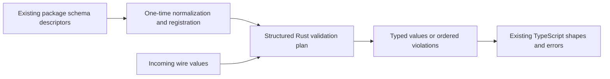

# Package subsystem port feasibility

Research date: October 6, 2026. Original design checkpoint: `7ea481575a6f4afeead9a073c5799873a02edc8b`. The [full evaluation of all four candidates](full-evaluation.md) uses checkpoint `011fced78cbb3762ce838066295468bdd23e5b8a`, adds consumer tracing and baseline verification, and supersedes the preliminary ratings.

The subsequent [boundary redesign evaluation](boundary-options.md) examines larger coherent operations, parser-owned inputs, shared work/state transitions, native preparation and adjacent package candidates at checkpoint `30e211dae891cfdca3f6322ce45c46c426138830`. Its conditional estimates apply to those changed scopes; they do not replace the complete legacy-API ratings below.

The [four implementation plans](implementation-plans/README.md) define exact-values, owned-input validation, shared work/state transitions and native artifact preparation tasks, common prerequisites, compatibility/distribution gates and rollout/rollback. They preserve package-only scope and feature-based names; production implementation remains future work.

The recommended first Rust experiment is exact arithmetic behind the existing package API, after establishing representative TS workloads or a concrete native reuse need. A package-local values core and small WebAssembly binding crate are a plausible route. Start with arbitrary-precision scratch arithmetic, then measure fixed-width alternatives and complete scalar/batch calls before adopting them. Full wire/schema validation needs a separate host-compatibility design; registered ordinary-data plans are a useful narrower starting point.

This is a migration proposal, not an implemented API or a performance result. The porting scope is existing functionality under `packages/`. Compiler changes are excluded. This document retains detailed arithmetic/validation design and historical backend consultations; the companion [full evaluation](full-evaluation.md) compares all four against the same scope, compatibility, delivery, maintenance and benefit criteria.

## Feasibility ratings

These are revised engineering estimates of completing a behavior-preserving package port, including its runtime adapter and build/distribution integration. They do not rate expected speedup, business value or probability of success. Scores of 7–8 mean a tractable bounded port with meaningful compatibility or integration work; 5–6 require substantial unresolved boundary work. The initial 9/7/8/8 estimates gave too much credit to proposed integration. No Rust implementation or target-runtime spike has yet validated these estimates.

| Subsystem and bounded scope | Feasibility | Main reason and remaining work |
| --- | --- | --- |
| Exact arithmetic in `packages/values` | **7/10** | Explicit algorithms and conformance evidence make the native core tractable; arbitrary BigInt helper inputs, carrier/errors, conversion costs and real binary delivery still need proof. |
| Wire/schema value validation in `packages/values` | **5/10** | An ordinary-data plan interpreter is viable, but complete unknown-input parity includes observable getter/proxy reads, presence, surrogate text, ordered errors and frozen/shared identity. |
| Pure recurrence/retry/recovery decisions in `packages/work` | **7/10** | Bounded policy calculations are tractable; preserve callback timing, fractional timestamps, hashing and fences, and account for policy mirrors in existing command stages. |
| Local artifact validation and compatibility/plan calculations in `packages/cloudflare` | **7/10** | Metadata calculations are straightforward; preserve host JSON/text/additive/error behavior and prove the synchronous adapter and distribution. |

The moderate candidates can be easier to implement than full value validation while offering less demonstrated benefit. The labels describe suitability/payoff, not technical difficulty. All four are package-owned; none is a compiler port. The ratings deliberately exclude the complete durable-work engine and complete platform CLI.

## Package scope and ownership

| Package | Proposed responsibility |
| --- | --- |
| `packages/values` | Rust arithmetic/validation core, Wasm bindings, TypeScript compatibility façade, schema registration, existing catalog ownership and parity tests. |
| `packages/contracts` | Preserve public value/error shapes; add a versioned internal validation-plan or asset contract only if shared consumers need it. |
| `packages/stdlib` | Continue exposing the same names and synchronous signatures. |
| `packages/cloudflare` | Initialize the Worker adapter and stage typed Wasm assets beside JavaScript modules. |
| `packages/testkit` | Carry binary modules through local workerd test setup. |

State admission, authorization, transactions, workflows, identity, UI, and service adapters keep their existing owners. A Rust validator decides shape, normalization and exact values; it does not decide whether a user may read or mutate a record. Existing example/test consumer fixtures outside packages may need verification updates, but no source subsystem there is being ported.

A possible private layout, to be reconciled with the living file-tree plan before implementation, is:

```text
packages/values/
  Cargo.toml            # private package build workspace
  semantics/
    Cargo.toml
    src/                # arithmetic, wire values, plans, validation, errors
  bindings/
    Cargo.toml
    src/                # host interoperability and Wasm boundary
  src/                  # existing public TS exports and compatibility adapters
  conformance/          # existing language-neutral behavioral fixtures
  test/                 # TS/native/Wasm differential consumers
```

Folder names describe responsibilities, not their implementation language. The `semantics` core is a normal native-testable library; `bindings` owns host interoperability. Only the binding crate depends on JavaScript APIs. Linking this core into the compiler is an optional future project, not required for this packages-only migration.

## Work scheduling and recovery decisions

The 7/10 rating covers slot/coalescing/occurrence identity in [every.ts](../../../packages/work/src/schedule/every.ts), failure/outcome/reconcile/backoff rules in [receipt/index.ts](../../../packages/work/src/receipt/index.ts), and data-driven stale-claim and recovery/fanout/progress planners in [recovery/index.ts](../../../packages/work/src/recovery/index.ts). A responsibility-based internal name is `decisions`.

Use a closed snapshot and explicit time/policy inputs per decision batch. Keep row suppliers, database scans, dispatch guards and fenced state application in the existing host. In particular, `scanDueBatch` and `drainDueScan` call storage suppliers and are not just snapshot calculations. Returning a recovery decision does not perform durable recovery.

Backoff consumes randomness once only after validation and exhaustion checks; exhausted attempts consume none. Recovery evidence callbacks run only for uncertain rows in input order before output sorting. An adapter must preserve these calls and exception order rather than eagerly resolve all inputs. Host callbacks or a deliberately staged request/result boundary can retain this behavior; that boundary needs a spike before adoption.

Also preserve finite fractional timestamps where currently accepted, inclusive expiry/horizon boundaries, SHA-256 input bytes and JS number/string formatting in occurrence IDs, and sort semantics. Frozen retained payloads and unknown result values need lossless transfer or host retention. Fanout planners must retain their settled/fresh-running/guard/lifecycle/exhaustion ordering, and every resulting mutation remains fenced by the existing work/state owners.

The [recurrence](../../../packages/work/test/every.test.ts), [receipt](../../../packages/work/test/receipt.test.ts), [recovery](../../../packages/work/test/recovery.test.ts) and [fanout recovery](../../../packages/work/src/recovery/t34-f4-scan.test.ts) suites provide behavioral targets. This is a reasonable second-wave port for clearer shared decision semantics; no inspected evidence establishes that these calculations dominate runtime cost.

## Local artifact validation and compatibility calculations

The 7/10 rating covers [artifact JSON/provenance checks](../../../packages/cloudflare/src/runtime/artifact.ts), pure [compatibility checks](../../../packages/cloudflare/src/deploy/compat.ts), and deterministic [deploy-plan calculations](../../../packages/cloudflare/src/deploy/plan.ts). A responsibility-based internal name is `artifacts`. The current source is under `packages/cloudflare`, even though it reads output produced by the compiler.

Keep filesystem orchestration and the current JS consumers around a native library or measured Wasm adapter. A package-owned executable is another option; it would require its own distribution and process wrapper without migrating the compiler. Repeated process startup for small checks may outweigh the work being ported. Do not move the whole CLI to achieve a metadata-check port.

Preserve artifact validation's first-failure order, source-path attribution, generated JavaScript/source-map content, additive optional fields and unknown metadata where currently tolerated. Rust deserialization errors alone do not reproduce those rules, and replacing JSON.parse changes malformed-JSON diagnostics and potentially string handling. One package-only route keeps host JSON parsing/error formatting and transfers a lossless parsed representation for semantic checks. Compatibility preserves its ordered reason list; plan building preserves resource order and unresolved-binding failures. Schedule backend gaps must remain visible rather than inventing a cron mapping.

Later manifest/hash and release-lockstep checks are also feasible, but filesystem discovery and packaging costs belong in their own tranche. Node crypto already performs hashing, so rewriting hash calls is not evidence of a speedup. Keep module assembly, activation/deployment, Wrangler, Miniflare and runtime invocation outside the rating.

Relevant behavioral evidence includes [artifact tests](../../../packages/cloudflare/test/artifact.test.ts), [additive field-description tests](../../../packages/cloudflare/test/artifact-field-descriptions.test.ts), [compatibility tests](../../../packages/cloudflare/test/compat.test.ts), [plan tests](../../../packages/cloudflare/test/plan.test.ts) and [manifest tests](../../../packages/cloudflare/test/release.test.ts). Payoff would primarily be reusable native validation and tooling packaging; performance remains unmeasured.

## Exact arithmetic

Can owns the arithmetic semantics. Port the algorithms in [int.ts](../../../packages/values/src/int.ts), [decimal.ts](../../../packages/values/src/decimal.ts), [money.ts](../../../packages/values/src/money.ts), UTC portions of [temporal.ts](../../../packages/values/src/temporal.ts), and exact numeric aggregates in [array.ts](../../../packages/values/src/array.ts). Preserve the equality rules in [equality.ts](../../../packages/values/src/equality.ts).

| Behavior | Required parity |
| --- | --- |
| Decimal carrier | Coefficient × 10 to the negative scale; scale 0..18; coefficient magnitude below 10^38. Stored trailing zeros count toward the coefficient-digit limit. |
| Scale and equality | Preserve authored carrier scale; numeric equality crosses scales. Deriving equality/hash solely over coefficient and scale would change behavior. |
| Add/subtract | Align exactly at the maximum scale; reject an out-of-range result. |
| Multiply/divide | Multiply exactly, round half-even only at the prescribed fractional boundary, then check coefficient range. Division keeps a terminating result's minimal scale within 18 places; otherwise round directly at scale 18. |
| Money | Use the pinned currency/scale table; compute an exact rational and round once before int64 narrowing. Preserve currency-error precedence. |
| Integers/durations | Preserve checked result overflow, truncating remainder sign, division-by-zero and inexact duration division. In particular, minimum-int64 remainder by -1 is zero, not a Rust arithmetic panic. |
| Aggregates | Accumulate exact intermediates and check the final sum once; cancellation must remain independent of input order. Binary expression chains retain their per-operation checks. |
| Failures | Distinguish malformed construction, construction range, arithmetic overflow, division-by-zero, currency mismatch and inexactness using existing codes. |

For admitted values, private Rust newtypes can store int/duration/minor/version as i64, bounded UTC instants as i64, and Decimal as an i128 coefficient plus u8 scale. Some current public helpers accept arbitrary JS BigInts and narrow only their result. Examples include `addInt`, `compareInt`, and the bigint operand branches of Decimal operators. Structural money construction also does not itself narrow the minor. Preserve these broader exports through a raw BigInt compatibility API; do not introduce earlier argument rejection merely because native convenience types are bounded.

### Arithmetic library comparison

| Backend | Fit | Cost or limitation |
| --- | --- | --- |
| Can algorithms with `num-bigint` | Recommended first backend. Arbitrary operands and wide scratch values reproduce the current JS BigInt model. Bounded carriers can still use i128/i64. | Heap allocation and Wasm size may outweigh arithmetic gains. Benchmark rather than assume. |
| Can algorithms with a signed 256-bit backend such as `bnum` | Credible later fast path for admitted bounded values. | Requires width proofs, checked error mapping and a compatibility route for unrestricted helper inputs. |
| `bigdecimal` with a Can wrapper | Represents the full domain and offers explicit scale rounding. | Can still needs its grammar, scale/digit checks, minimal terminating division, canonical wire and failure semantics. Implicit precision contexts can round where Can must reject. |
| `rust_decimal` | Useful financial decimal library with retained zeros and rounding support. | Its 96-bit coefficient cannot represent Can's full 38-digit coefficient domain; it is unsuitable as a drop-in core. |
| `ruint` | Fixed unsigned limbs can implement bounded magnitudes. | Signed arithmetic requires an additional sign representation, and Can needs its own decimal wire format. |

Primary references: [num-bigint](https://docs.rs/num-bigint/latest/num_bigint/), [bnum](https://docs.rs/bnum/latest/bnum/), [bigdecimal](https://docs.rs/bigdecimal/latest/bigdecimal/), [rust_decimal representation](https://docs.rs/rust_decimal/latest/rust_decimal/), [ruint](https://docs.rs/ruint/latest/ruint/).

Width reasoning explains why an i128 carrier is viable but i128 scratch is insufficient. Valid scale alignment is below 10^56; exact products are below 10^76; an 18-place division numerator is conservatively below 10^74. A signed 256-bit work type covers these bounds. Valid Decimal aggregate alignment with at most u64::MAX terms stays below 10^56 × 2^64, also within that width. These are derived bounds over validated operands, not benchmarks and not a bound on every current raw helper argument.

An initial bounded-carrier plus BigInt-scratch design avoids premature width failures while retaining a later fixed-width implementation option. Do not normalize a coefficient just to make it fit, round to 38 digits instead of rejecting, or check aggregate overflow at each partial sum.

## Value validation

Port the Can-specific traversal and codecs in [schema.ts](../../../packages/values/src/schema.ts) and [wire.ts](../../../packages/values/src/wire.ts). Serde can transport internal DTOs; it does not replace the semantic validator.

The existing `NormalizedField.type` already contains a structured `NormalizedType`. A packages-only first step can keep descriptor normalization in the TS adapter, register a versioned ordered Rust plan once, and validate by schema/operation/type handle. Pre-resolve union arms and leaf codecs during registration. Existing string-based exports remain compatibility adapters; cache bounded or schema-scoped resolutions rather than growing an unbounded global cache from caller strings.



No compiler modification is needed for this route. Dynamic invocation arguments can contain external `{type,value}` strings, so unknown supplied type IDs still need checked parsing or registry lookup. A complete later compiler-emitted plan could remove more startup work, but current generated model descriptors are not a complete validation contract: some validated strings collapse to string and other types have fallback descriptors. Treat that as a separately scoped follow-up.

### Validation parity

| Area | Behavior to preserve |
| --- | --- |
| Exact wire | Integer, Decimal, money minor, duration and version use decimal strings; numeric JSON inputs in those positions fail. Preserve normalization of accepted leading zeros/-0, Decimal decode scale versus canonical encode, and exact UTC millisecond datetime spelling. |
| Presence | Missing/present-undefined differs from explicit null. Create applies defaults and implicit nullable/ordinary-array values subject to bounds; updates preserve omission and never apply defaults. |
| Engine fields | Omitted server/derived create fields stay absent so the engine supplies them; explicit supplied values still validate. |
| Nested values | Present contract fields can be update partials; array elements and union branches remain complete values. Literal descriptor defaults do not inherit nested defaults. |
| References | Submitted mutation refs require versions recursively; query refs preserve optional versions. Preserve the distinct action-binding and invocation rules. |
| Closedness and secrets | Reject extra present fields/arguments; ordinary closed-object checks treat undefined-valued keys as absent. Opaque JSON is stricter. Refuse secret serialization and preserve union discrimination and nominal-versus-model behavior. |
| Errors | Collect all required violations in existing order and preserve code, path, message and optional expected/actual metadata. Return no partial successful value. Recreate existing `ValueError` and `SchemaError`; neither becomes a business rejection. |
| JS observables | Preserve bigint and Decimal/object carriers, frozen outputs, canonical omission symbols and shared frozen defaults/empty-array identity where observable. |

Keep defaults/errors/typed construction in a Can interpreter rather than adding a generic JSON Schema engine as its authority. JSON Schema's standard default is an annotation, not missing-value insertion; Can also needs update sentinels, trimming, exact-value creation and version admission. A generic engine would need those custom behaviors and an ordered-error adapter. It remains a reasonable auxiliary tool for external JSON Schema work. [JSON Schema defaults](https://json-schema.org/understanding-json-schema/reference/annotations).

The opaque `json` kind is intentionally narrower than generic JSON: it permits null, strings, booleans, arrays and objects but rejects every numeric value, including safe integers, as well as bigint and other non-JSON kinds. It also rejects undefined-valued object members and array elements rather than treating them as absent. A Serde JSON transport must not accidentally admit numbers or erase these failures; preserve this distinction from ordinary contract/ref/operation object checks. Opaque JSON also preserves safe own `__proto__` keys; the output adapter must recreate those as data properties rather than change an object's prototype.

### Lossless JavaScript boundary

The public API accepts `unknown`, not only parsed JSON. JSON.stringify or automatic Serde conversion can collapse undefined/null, convert non-JSON values, reorder keys, reject BigInts before Can classifies them, or change error metadata.

Use an explicit input representation: tagged scalar kinds, ordered object entries in observed JS enumeration order, arrays that preserve holes/undefined, and a presence marker distinct from null. Invalid JS kinds need enough information to produce the original Can rejection and actual-value description. Cycles/getters/proxies need an explicit compatibility treatment based on current evaluation behavior; do not silently promise support beyond the existing API.

JS strings can contain lone UTF-16 surrogates, which Can's [text tests](../../../packages/values/test/text.test.ts) explicitly accept. Ordinary Rust String is valid UTF-8 and cannot directly retain these units. Use a lossless UTF-16 representation for arbitrary text/keys, or retain affected handling in the host adapter. A fast UTF-8 representation for well-formed strings with a UTF-16 exceptional form is an option to measure. Lossy replacement or rejection would change behavior. [Rust String](https://doc.rust-lang.org/std/string/struct.String.html).

Ordered field vectors and input entries preserve diagnostic order. `serde_json::Value` normally uses sorted maps; `preserve_order` is necessary where that transport is appropriate but does not recreate JS numeric-property ordering by itself. Preserve missing versus null through explicit variants rather than indexing a missing field as JSON null. [Serde JSON values](https://docs.rs/serde_json/latest/serde_json/value/enum.Value.html).

Leave Intl locale canonicalization, pinned timezone/ICU behavior and WHATWG URL acceptance at the host boundary initially. Exchange compact batches of host checks/results when useful, or keep those specific leaf codecs outside the Rust tranche. Moving them later requires independent differential validation and pinned data behavior.

## Wasm integration

Use one `wasm32-unknown-unknown` binary with a small `wasm-bindgen` adapter. Keep the public values functions synchronous after one-time initialization, so generated app execution order and consumers remain compatible. A Worker entry can pass its imported precompiled WebAssembly.Module to a synchronous initializer; a Node/Bun entry can load local bytes. Pin and test the exact generated glue rather than depending on default bundler assumptions. [Cloudflare JavaScript Wasm](https://developers.cloudflare.com/workers/runtime-apis/webassembly/javascript/), [wasm-bindgen synchronous initialization](https://wasm-bindgen.github.io/wasm-bindgen/examples/synchronous-instantiation.html).

Direct wasm-bindgen i64/i128 arguments use JS BigInt, but oversized inputs wrap. Accept raw checked DTO/string/limb input or validate before narrowing. Small numeric fields such as scale also need checked conversion: JS Number conversion can truncate/wrap. Stable domain errors must come from Can validation rather than a binding cast. [wasm-bindgen numeric conversions](https://wasm-bindgen.github.io/wasm-bindgen/reference/types/numbers.html).

`serde-wasm-bindgen` is useful for controlled DTOs. Its defaults include maps as ES Maps, missing values as undefined, and i64/u64 as safe JS numbers or errors. Configure BigInt output and plain-object maps as needed; avoid its JSON preset indiscriminately because it also converts missing values to null. It does not remove the need for the lossless input/output adapter. [Serializer configuration](https://docs.rs/serde-wasm-bindgen/latest/serde_wasm_bindgen/).

Prefer whole-operation validation and batch aggregates over a Wasm call per leaf. Direct arithmetic exports can retain current signatures, but benchmark their complete adapter calls. Opaque persistent values that require application authors to manage handles would complicate the current JS object API; use plan handles internally and manage their lifetimes within the package.

### Delivery changes

The current [deploy bundler](../../../packages/cloudflare/src/deploy/bundle.ts) reads only .js files into text maps, scans every value as JavaScript and writes UTF-8. The [local runtime](../../../packages/cloudflare/src/dev/local-run.ts) marks every module as ESModule. A .wasm file would currently be dropped or misclassified.

Required integration work:

1. Represent delivery assets by type: ESM/text versus compiled-Wasm/bytes.
2. Stage the binary under a stable relative vendor name and select the Worker adapter explicitly.
3. Rewrite/scan only JavaScript, while verifying JavaScript-to-Wasm imports resolve.
4. Write binary bytes intact; compute deterministic hashes and true byte lengths for both module types.
5. Register Wasm as CompiledWasm in local workerd; append source maps only to JavaScript.
6. Carry this representation through package testkit and existing integration fixtures, and verify release manifests include the binary.
7. Make the values build generate/copy Wasm before dependent TS package builds; pin the Rust toolchain, binding generator and dependencies.

Miniflare supports CompiledWasm modules. [Miniflare module rules](https://developers.cloudflare.com/workers/testing/miniflare/core/modules/). No change to compiler-generated artifact modules is required for an initially runtime-owned Wasm asset.

A native Node-API addon plus Wasm could be measured later if local tooling warrants it. Starting with both introduces extra platform builds and two loading/ABI paths before a useful speedup is known. Rewriting the whole Worker with workers-rs is outside scope.

## Migration sequence and acceptance

| Stage | Deliverable | Acceptance |
| --- | --- | --- |
| 1. Freeze parity targets | Enumerate the two port surfaces and wrappers; reuse current conformance and edge tests. | Document every deliberate host-held export and compatibility branch. |
| 2. Native arithmetic | Bounded carriers, BigInt raw/scratch paths, exact rounding and error rules. | Match values, stored scales, canonical wire, error class/code and precedence against current TS. |
| 3. Native validation | Registered structured plans plus lossless input/value/error representation. | Match omission/default behavior, ref versions, freezing/identity adapter rules and ordered diagnostic metadata. |
| 4. Package Wasm adapters | Shared binary, separate host initialization, preserved public exports. | The same cases pass through native Rust, Node/Bun and workerd; no binding narrowing or unexpected async API change. |
| 5. Delivery integration | Typed binary modules, release manifests, reproducible package builds. | Deterministic bundles, no Node imports in Worker graph, and explicit failure for missing/corrupt assets. |
| 6. Adopt and optimize | Replace each package tranche only after its gates; compare fixed width and batches. | Useful correctness/sharing or measured operational benefit with an explicit acceptable regression budget. |

Reuse [versioned conformance](../../../packages/values/conformance/v1/README.md), int/decimal/money/temporal/schema/wire suites and [Decimal.js oracle cases](../../../packages/values/test/decimal-oracle.test.ts). Oracle value agreement alone misses stored-scale and error differences; preserve structural observations too. Add widest coefficients/products, scale-alignment cancellation, rounding carries, aggregate permutations, arbitrary raw BigInts, minimum-int remainder, omission/null/undefined, surrogate text/keys and order-sensitive error cases.

Compare warm complete calls, conversion-only overhead, whole nested validation, scalar/batched arithmetic, error-heavy inputs, initialization/first request, compressed binary/bundle size, memory growth and end-to-end state writes. Cloudflare production timers do not advance during uninterrupted CPU work, so use local workerd CPU profiling and externally observed latency rather than deriving microbenchmarks from production performance.now(). [Cloudflare timers](https://developers.cloudflare.com/workers/runtime-apis/performance/). Respect platform startup and memory limits when judging the package result. [Workers limits](https://developers.cloudflare.com/workers/platform/limits/).

Resource limits for opaque JSON remain unresolved in the existing wire module; a Rust port must not silently claim to have resolved that language-design gap. Concrete recursion/size/handle lifetime policies require explicit parity or separately agreed behavior before production.

## JEV advice and uncertainty

Three independently worded equivalent choice consultations used the verified source/library context and equal parity goals. [Requests and exact responses](evidence/) retain full distributions, model identity and usage.

| Question | Consultation 1 | Consultation 2 | Consultation 3 |
| --- | --- | --- | --- |
| BigInt-first arithmetic | Probability .93; confidence .89 | .95; .93 | .53; .30 |
| Fixed-width-first arithmetic | .07 | .01 | .41 |
| Bigdecimal wrapper | .00 | .04 | .06 |
| Can plan interpreter | Probability .93; confidence .89 | .98; .96 | .99; .99 |
| TS traversal with Rust leaves | .07 | .02 | .01 |
| Generic JSON Schema backend | .00 | .00 | .00 |

All selected BigInt-first and the Can interpreter, but the third arithmetic result was close. The substantive reason to retain fixed width as an alternative is that valid bounded operands have demonstrably manageable intermediate widths. The extra initial cost is preserving broader raw helper inputs and proving every path, not an inherent inability to implement Can with fixed integers. Native/Wasm benchmarks can justify changing the backend choice; the consultation probabilities cannot establish performance or correctness.

The requests are equivalent by subject, constraints, option identities, benefits/costs and acceptance criteria, with rewritten state, question and criterion prose. This checks wording sensitivity, not absence of framing bias. The model was jev-1.13.0; total reported usage was 3,552 input and 282 output tokens. Advice is not an approval threshold.

Investigation of the close arithmetic result included [a reproducible source probe](evidence/arithmetic-probe.mjs) and [its observations](evidence/arithmetic-probe.result.json). Bun imported the current TypeScript source directly. Fifteen targeted assertions passed, including helpers with 10^1000 operands that cancel to valid results, wide Decimal multiplication/division, retained-scale aggregate cancellation, and minimum-int64 remainder. Mathematical checks measured 127 coefficient bits, 187 aligned bits, 253 product bits, 246 scaled-division bits and 251 aggregate-bound bits. This verifies current TS behavior and the stated magnitude calculations; it does not verify a Rust implementation or replace the full package suites.

This historical design round added research documentation and consultation evidence without changing source behavior. The later [full evaluation](full-evaluation.md#evidence-limitations-and-adoption-gates) built the current values package, ran 431 selected existing tests, checked work/Cloudflare types, and added boundary probes. No Rust implementation, target-runtime feasibility spike or comparative benchmark was executed.
