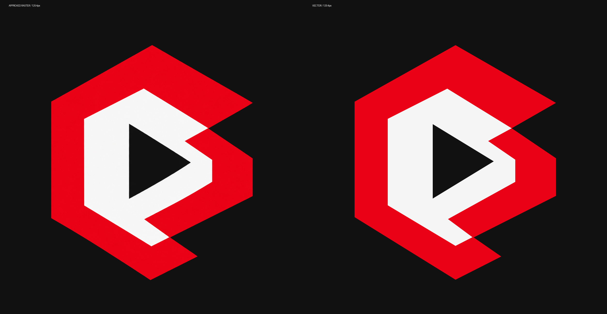

# CanLang logo previews

Vectorization reviewed on 2026-10-05. These renders and verification records accompany the production assets in the parent directory and are excluded from the extension package.

| Asset | Purpose |
| --- | --- |
| [../icon-dark.png](../icon-dark.png) | Unchanged, founder-approved 1254×1254 RGBA raster source. |
| [../logo.svg](../logo.svg) | Transparent adaptive master, `viewBox="0 0 1024 1024"`. Constant red `#EB0115`; inner mark `#F5F5F5`, switching to `#141414` under `prefers-color-scheme: light`. |
| [../icon.png](../icon.png) | Opaque 512×512 RGB extension icon on `#111111`, using the dark-theme mark. |

The vector preserves the raster proportions, following the founder's choice over globally equal ring widths. It removes the triangle fringe and transparent cracks and centers the bottom apex. Both paths have an evenodd triangle knockout. The lower red aperture has a small hidden outward offset to prevent red antialias bleed through the inner mark's edge.

## Visual review

- [Dark 512px](dark-dark-512.png) and [light 512px](light-white-512.png).
- [Both themes on both backgrounds](themes-512.png).
- [48px and 16px contact sheet](small-sizes.png), including enlarged 16px pixels for inspection.
- [Same-scale raster/vector comparison](side-by-side-1254.png): approved raster left, vector right, each rendered at 1254px before composition.

`{theme}-{background}-{size}.png` names use `dark` or `light` for the theme, `dark` (`#111111`) or `white` (`#FFFFFF`) for the background, and 512, 48 or 16 for the size. `browser-{theme}-{background}-512.png` contains the Chrome renders. The separate 1254px master/vector images preserve the inputs to the comparison; `vector-transparent-1254.png` also preserves the alpha channel.

## Verification records

| Record | Scope |
| --- | --- |
| [geometry-verification.json](geometry-verification.json) | Raster/vector extents, horizontal outer-edge differences, sampled transparent triangle pixels, opaque PNG checks and source/SVG SHA-256. |
| [browser-media-verification.json](browser-media-verification.json) | Chrome's computed inner fill and media-query result for both themes and backgrounds. |
| [renderer-comparison.json](renderer-comparison.json) | Chrome/rsvg pixel comparisons and triangle background samples. Chrome inline and external-image SVG renders matched exactly. |

Chrome and rsvg agree on geometry and colors; edge antialias coverage differs. rsvg's light renders used an explicit `.inner { fill: #141414 !important; }` stylesheet because the command-line renderer has no theme preference switch. Chrome selected each theme through its emulated color-scheme preference.

At 1254px, the median measured horizontal outer-edge difference is 1px and the 95th percentile is 4px. The maximum is 9px near the intentionally recentered bottom apex. Low contrast in the dark-theme-on-white and light-theme-on-dark combinations follows the requested colors.

`vsce ls` and `vsce package` accepted the production SVG and opaque icon; prepublish compilation passed. The package warning concerns the extension's missing LICENSE file. Packaged VSIX files belong in the existing ignored `output/editor/` directory.
