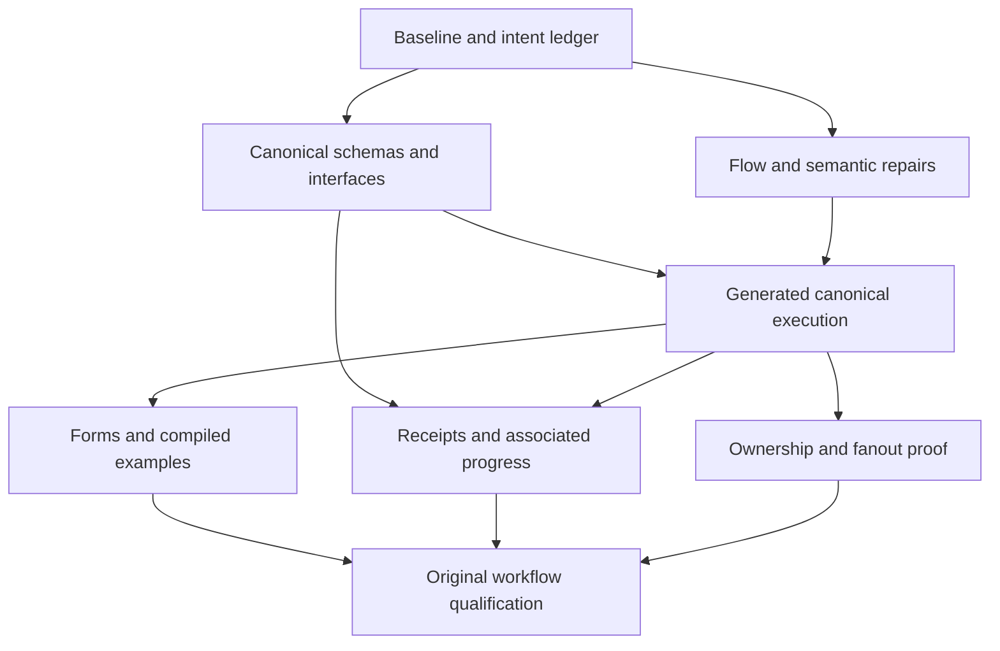

# CanLang challenge audit recommendations and task list

Status: proposed implementation plan and execution backlog, recorded October 5, 2026. The challenge audit and recommendation round were read-only. The user subsequently requested that the recommendations and task list be saved. Saving this document does not start implementation, adopt unsettled language rules, or authorize deployment.

The next milestone should be faithful, executable applications from the authoritative draft corpus. This serves CanLang's primary goal of adoption through economical AI generation, reliable behavior and concise source. The compiler should accept coherent business intent, preserve meaningful safety boundaries, and produce applications whose permissions, workflows, interfaces and examples actually work. Diagnostic reduction is supporting evidence, not the completion criterion.

This document consolidates the challenge audit's recommendation plan and the 41-task backlog. It retains evidence, opposing arguments, confidence, dependencies, completion criteria and unresolved decisions so future work does not depend on the chat.

## Authority and scope

The 49 top-level .can drafts are the authoritative record of what the language designers wanted to express. Checker rules and normative documentation are implementations of that intent. A restriction needs a demonstrated safety, clarity or implementability benefit; citing the restriction itself does not justify it.

Drafts still need evidence-based scrutiny for typos, incomplete migrations and abandoned experiments. Handwritten .mjs files are desired-output witnesses. They can clarify intent or silently repair a source mistake; they do not prove faithful compilation or installed runtime APIs.

The audit's five disposition buckets remain distinct:

| Bucket | Meaning | Required response |
| --- | --- | --- |
| a | Rule correct, draft wrong | Correct the demonstrated source defect through the draft owner |
| b | Draft correct, rule wrong or implementation missing | Repair the compiler, design or missing producer/integration |
| c | Rule directionally right but too strict | Specify the weaker safe rule and its cost |
| d | Unadopted proposal syntax | Adopt with a complete contract or scope it with reasons |
| e | Deliberate negative witness | Retain the intended rejection and cite its purpose |

Every conflict needs a strongest opposing argument, locally labeled observations and inferences, confidence, and the evidence that would change its verdict. Existing B4 classifications are navigation aids rather than authority. Preserve useful historical evidence without carrying its classifications forward unexamined.

The product remains focused on CRUD-centered company SaaS and bounded provider-backed workflows. Specialized execution belongs to providers and reusable libraries; app source owns purpose, authorization, budgets, approval and business meaning. See [requirements](/Users/vince/Projects/canlang/REQUIREMENTS.md), [shared boundaries](/Users/vince/Projects/canlang/implementation/CONTRACTS.md), [implementation ownership](/Users/vince/Projects/canlang/implementation/PLAN.md), and [diagnostic policy](/Users/vince/Projects/canlang/implementation/DIAGNOSTICS.md).

## Observed baseline

[OBSERVED] The recommendation round reproduced 4,524 diagnostics from 52 sources: 49 application drafts and three shared sources. The existing compiler binary returned exit 10, complete=true and omitted=0. Analysis completion does not establish language coverage or runtime completeness. The binary was observed as installed; this round did not rebuild it from the current source tree.

| Code | Diagnostics |
| --- | ---: |
| E3001 | 1301 |
| E2001 | 1122 |
| E3003 | 951 |
| E2013 | 403 |
| E3015 | 208 |
| E3002 | 136 |
| E3019 | 86 |
| E3013 | 74 |
| E3005 | 44 |
| E3009 | 44 |
| E3010 | 28 |
| E2005 | 24 |
| E3012 | 23 |
| E2008 | 20 |
| E3011 | 15 |
| E5002 | 11 |
| E5006 | 6 |
| E5008 | 5 |
| E3016 | 5 |
| E2017 | 5 |
| E1203 | 4 |
| E2002 | 3 |
| E5004 | 2 |
| E3006 | 2 |
| E5001 | 2 |

These codes have multiple roots, and roots produce diagnostics in multiple families. Counts are not independent defects. No exact percentage of checker overreach versus draft error was established.

| Input | Recorded SHA-256 |
| --- | --- |
| Existing compiler binary | f9bc737af0635975655970121df0cd7471b72c7e9e47c2490c7a6bf18bd86a8e |
| Producer catalog | cd984f375e0d6cbcc2bc6aca5ad5ea5b1b3d3ba9cd17b15ab94e4b15e74ced62 |
| Ordered draft source bundle | eca2b18a1d047dca641a5663713037c63c669cd59d50fdd1630c6e14202db762 |

The bundle hash was calculated from sorted repository-relative paths, a NUL separator, each file's bytes and another NUL separator. Source sites below belong to this audit snapshot; revalidate positions and behavior before implementation.

[OBSERVED] The audit counted 830 occurrences of runtime error expectations across the 49 top-level apps and found no explicit whole-file compile-negative intent. This count is not a count of executed tests or necessarily distinct example rows.

Strongest opposing case: the drafts contain real mistakes and unfinished proposals, so treating every rejection as overreach would erase useful boundaries and create false confidence.

[INFERRED] Use a site-level root-cause ledger. Retain workflow intent, adjudicate source defects individually, and keep required unavailable capabilities visible until they are implemented or explicitly scoped.

## Evidence and completion records

The root-cause ledger should record source revision, file/span/context, one-sentence author intent, root versus consequence, one disposition bucket, opposing case, resolution, owner, positive/negative proof, confidence and flip evidence.

Keep semantic disposition separate from implementation availability. Accepted-but-unimplemented behavior does not become an abandoned proposal because its checker or runtime is absent.

| Evidence level | What it establishes |
| --- | --- |
| Intent reviewed | Desired behavior and remaining questions are understood |
| Source checked | Accepted construct passes relevant static checks |
| Artifact produced | Generated descriptors, code and requirements are valid and linkable |
| Runtime connected | Generated operations use canonical admission, queries and commits |
| Examples executed | Independently authored expectations run against those operations |
| Workflow qualified | Browser/MCP, permissions, persistence and recovery agree |

No lower level should be reported as a higher one. Status-file test counts are historical evidence unless rerun. Handbuilt integration fixtures, memory doubles, local workerd/storage execution, controlled provider responses and live-provider evidence must remain distinguishable.

## Execution waves and ownership

Reuse the existing seven implementation owners. The audit does not justify a replacement compiler or runtime.

| Lane | Responsibility |
| --- | --- |
| L1 | Rust compiler, analysis, code generation and authoring tools |
| L2 | Exact values, schemas, normalization, codecs and pure builtins |
| L3 | Canonical admission, authorized queries, mutation, history, replay and storage |
| L4 | Durable work, services, receipts, progress and file lifecycle |
| L5 | Presentation catalog, form descriptors and rendering |
| L6 | Identity, browser/MCP transport and verified invocation context |
| L7 | Platform assembly, actual storage, executable examples and qualification |

| Wave | Scope | Exit condition |
| --- | --- | --- |
| A | Baseline, attribution and contracts | Traceable intent ledger and agreed acceptance cases |
| B | Flow, selectors, authorization and value/input semantics | Valid focused cases pass and invalid controls remain |
| C in parallel with B | Standard interfaces and generated execution bridge | A generated operation reaches canonical admission and persistence |
| D | Forms, examples, receipts and accepted progress | Original business journeys execute through production paths |
| E | Ownership/hook decisions and fanout adoption | Accepted contracts with corresponding execution proof |
| F | Corpus qualification and proven corrections | Accurate per-app capability and release evidence |



Start interface production and execution integration alongside bounded checker repairs. Estimate packages once producer/consumer contracts and acceptance cases are concrete. Distinguish implementation effort from waiting on another owner.

## Detailed recommendations for the top ten challenges

### Ordinary nullable flow

[OBSERVED] The drafts repeatedly use ordered null guards, including [Affiliate evidence](/Users/vince/Projects/canlang/draft/CanAffiliate.can:88), [Approve notices](/Users/vince/Projects/canlang/draft/CanApprove.can:264), [Catch optional tasks](/Users/vince/Projects/canlang/draft/CanCatch.can:89), [Chat allowance admission](/Users/vince/Projects/canlang/draft/CanChat.can:71), [Check heartbeat admission](/Users/vince/Projects/canlang/draft/CanCheck.can:65), and [Contract previous terms](/Users/vince/Projects/canlang/draft/CanContract.can:33). The intended behavior is to consume a value only in the continuation that established its presence.

Strongest opposing case: deliberately small narrowing is easier to implement soundly around mutable records, aliases and compound conditions. DESIGN also contains wording excluding ordinary null comparisons from a particular narrowing fact.

[INFERRED] Bucket b, high confidence. Explicit null tests should provide ordinary continuation facts while remaining separate from permission reasoning. Extend the existing analysis rather than weakening receiver, arithmetic, trim or argument contracts separately.

Specify true/false facts for equality and inequality, reversed operands, parentheses and NOT. AND's right operand receives left-true facts; OR's receives left-false facts. Branch joins retain facts valid on every reaching path. Successful requirements carry facts forward. Key facts by resolved declaration and path, distinguish immutable local values from mutable fields, and invalidate relevant facts around writes and mutation-capable calls.

Acceptance includes the six original patterns and guarded nullable text/datetime operations. Invalid controls include unguarded access, reads before guards, null admitted by another OR arm, alias writes, contradictory branches and zero-iteration loops. Safe-access comparisons against nullable values must not invent presence.

Cost: more flow bookkeeping and conservative rejection where alias mutation is uncertain. Flip evidence: a sampled read executes before its guard, or its guarded value can change without an enforceable invalidation boundary. Backlog: T03, T05, T07.

### Readable selectors

[OBSERVED] There are 257 exact parent and 99 metadata selector failures within E2013. Ordinary member lookup already recognizes local implicit parent and metadata while selector checking uses a narrower path. Representative intent is authorized history and relationship disclosure in [Approve](/Users/vince/Projects/canlang/draft/CanApprove.can:18), [Book](/Users/vince/Projects/canlang/draft/CanBook.can:34), [Check](/Users/vince/Projects/canlang/draft/CanCheck.can:22), [Contract](/Users/vince/Projects/canlang/draft/CanContract.can:32), and [Chat](/Users/vince/Projects/canlang/draft/CanChat.can:28). [Affiliate](/Users/vince/Projects/canlang/draft/CanAffiliate.can:253) also selects money.currency.

Strongest opposing case: permissive selectors might expose protected identities, cross references without authority, or accidentally turn readable metadata into writable/grantable fields.

[INFERRED] Bucket b, high confidence. Share canonical resolved member information with purpose-specific checks for reading, filtering, granting and writing. Preserve owner, type, supported leaves and reference/value provenance.

Acceptance covers parent, safe metadata, value members, nullable schema intermediates and imported aliases. Unknown leaves, invalid terminal descent, unauthorized traversal and metadata mutation remain invalid. A schema selector supplies no runtime non-null fact and no automatic permission grant. Preserve existing B4 delivery-leaf support.

Cost: a shared semantic member/path boundary with context-specific validation. Flip evidence: a proposed leaf causes disclosure that cannot be prevented by a precise authority check. Backlog: T08.

### Actor facts after admission

[OBSERVED] Simple scenario role narrowing and policy role-to-where narrowing already have B4 coverage. Remaining failures concern composite policy continuations and CRUD by-to-when facts. Contexts include [Affiliate](/Users/vince/Projects/canlang/draft/CanAffiliate.can:70), [Approve](/Users/vince/Projects/canlang/draft/CanApprove.can:18), [Book](/Users/vince/Projects/canlang/draft/CanBook.can:32), [CRM](/Users/vince/Projects/canlang/draft/CanCRM.can:47), and [Catch](/Users/vince/Projects/canlang/draft/CanCatch.can:34). The author intends caller-dependent checks after authenticated admission.

Strongest opposing case: actor is genuinely nullable in public operations, trusted handlers and preauthorization defaults. A role test on another person or an arbitrary helper cannot prove caller authentication.

[INFERRED] Bucket b, high confidence. Carry successful caller admission facts inside Boolean continuations and into CRUD when. Reuse the flow machinery and declared authentication predicates.

Acceptance retains nullable actor for public alternatives, other-subject roles, helpers before admission and signature defaults. Trusted payload users do not become callers. Preserve existing tests in [b4_check.rs](/Users/vince/Projects/canlang/compiler/tests/b4_check.rs:89).

Cost: contextual admission bookkeeping. Flip evidence: a supposedly admitted expression can succeed without an authenticated caller. Backlog: T06.

### Canonical standard and bound interfaces

[OBSERVED] The corpus contains 49 use std groups across 32 apps, 231 sends across 39 apps, 45 delivery type forms across 28 apps, 24 E2005 provider failures and 86 E3019 opaque-operation/recipe failures. [Chat](/Users/vince/Projects/canlang/draft/CanChat.can:5), [Creative](/Users/vince/Projects/canlang/draft/CanCreative.can:8), [Invoice](/Users/vince/Projects/canlang/draft/CanInvoice.can:13), [Event](/Users/vince/Projects/canlang/draft/CanEvent.can:12), and [Inbox](/Users/vince/Projects/canlang/draft/CanInbox.can:8) depend on typed protocols rather than arbitrary JSON.

Strongest opposing case: unknown interfaces must fail. Blindly accepting operation names, request shapes or receipts would falsely certify authority, accounting and file provenance.

[INFERRED] Bucket b, high confidence on missing interface production and resolution; medium on each unresolved recipe. Supply owning information while retaining strict validation.

Inventory imported names against accepted contracts. Reconcile versions and earlier producer DTOs. Export request/result/error schemas, effects, event and observable relationships from one authoritative producer definition; preserve canonical identity through aliases. Use that information for checking, runtime validation and discovery. Installed capability checks remain a separate build/activation obligation.

Start with common operation/delivery/email contracts, then generation/image/workflow interfaces, judgment/mailbox contracts and corpus operations. Reuse delivered adapters. Keep missing/private/misspelled members, incompatible bindings, wrong associations and forged protected handles invalid. E3019 remains valid when the real schema is absent.

Cost: producer catalog/contract work and explicit compatibility handling. Flip evidence: a named import or recipe conflicts with its actual accepted owner after resolution. Backlog: T12-T14.

### Creation defaults and input schemas

[OBSERVED] Employee.skills:text[] accounts for 28 fixture failures. Ordinary array omission is supported by requirements and the values producer, but fixture requiredness and emitted behavior diverge. [Effects analysis](/Users/vince/Projects/canlang/compiler/src/analysis/effects.rs:414) records required_array; the reviewed IR does not carry it; [JS emission](/Users/vince/Projects/canlang/compiler/src/codegen/js.rs:823) marks every non-null array requiredArray:true. The intent is concise valid setup and consistent creation behavior.

Strongest opposing case: explicit fixture inputs can reduce hidden assumptions. But requiring ordinary arrays contradicts a declared language default, and a fixture-only repair would leave generated behavior wrong.

[INFERRED] Bucket b, high confidence. Carry requiredness, omission, default, server initialization and derived distinctions separately from representation types through checking, effects, IR, artifacts, runtime, forms and MCP.

Ordinary arrays omit to empty; required arrays reject omission. Preserve documented nullable/default behavior, protected initialization, update omission versus explicit null, and derived/server exclusions from writable inputs. Defaults execute in their documented context/order and do not rerun on replay or ordinary updates.

Acceptance uses actual source-derived descriptors and existing values conformance, including parent, actor/time, server fields and replay. Model stored fields are not automatically writable operation inputs.

Cost: a shared semantic descriptor join and deliberate correction of contradictory emission expectations. Flip evidence: the disputed declaration is actually required-array syntax, or an explicit adopted fixture exception supplies demonstrated value. Backlog: T09, T15, T18, T19.

### Contextual structural values

[OBSERVED] The audit found 47 object-shaped fixture diagnostics. Representative values are [Affiliate qualification](/Users/vince/Projects/canlang/draft/CanAffiliate.can:50), [CRM research input](/Users/vince/Projects/canlang/draft/CanCRM.can:34), [Catch alert input](/Users/vince/Projects/canlang/draft/CanCatch.can:56), [Check alert input](/Users/vince/Projects/canlang/draft/CanCheck.can:31), and [Contract executed parties](/Users/vince/Projects/canlang/draft/CanContract.can:41). The author intends embedded typed value snapshots.

Strongest opposing case: named contracts can carry distinct meaning, and loose structural matching might accept missing fields, unrelated enums, forged references or incompatible versions.

[INFERRED] Bucket b, medium-high confidence. Validate literal construction recursively against a known expected closed contract. Preserve canonical identity and constraints; leave arbitrary named-type conversion to its own rule.

Acceptance covers known/unknown fields, required/default/nullable members, nested contracts/arrays, enum domains, exact bounds, model references and protected handles. Runtime fixture normalization agrees with static checking. Wrong shape and forged provenance remain invalid.

Cost: expected-type propagation and recursive validation using owning schemas. Flip evidence: an accepted contract is explicitly nominal, or contextual construction loses a meaningful identity boundary that closed checking cannot preserve. Backlog: T10.

### Imported containment

[OBSERVED] All 20 E2008 failures reject imported parents. [Expense](/Users/vince/Projects/canlang/draft/CanExpense.can:11), [Leave](/Users/vince/Projects/canlang/draft/CanLeave.can:22), [Onboard](/Users/vince/Projects/canlang/draft/CanOnboard.can:15), [Invoice](/Users/vince/Projects/canlang/draft/CanInvoice.can:58), and [Propose](/Users/vince/Projects/canlang/draft/CanPropose.can:40) deliberately retain canonical Employee/Customer identities.

Strongest opposing case: uncontrolled containment can introduce ownership/schema cycles, unstable reverse relationships, foreign policy extension or an impossible cross-store transaction promise.

[INFERRED] Bucket b, medium confidence, with a design gate. Separate declaring package identity, local executable closure, parent identity, inherited team/storage, mutation authority, reverse-child identity and migration consequences.

Local imports and deployment-bound remote schemas require different treatment. Import or containment supplies no automatic parent mutation authority. Acceptance retains source relationships while testing alias/order/composition parity, wrong parent, cross-team parent, missing/archive state, cycles and unavailable ownership. Prove applicable persistence/query behavior on actual storage and respect D1/DO boundaries.

Cost: a canonical ownership graph and lifecycle/migration rules. Flip evidence: concrete unsafety that cannot be enforced, plus a comparably concise alternative preserving the workflow. Backlog: T28, T29.

### Event and hook mutation provenance

[OBSERVED] Mutation checking routes paths beginning with event into hook-specific handling. Ordinary parameters and verified event references therefore collide with snapshot rules. [Leave hooks](/Users/vince/Projects/canlang/draft/CanLeave.can:73) and [Onboard hooks](/Users/vince/Projects/canlang/draft/CanOnboard.can:47) intend local parent revision updates; their desired .mjs witnesses express the same writes.

Strongest opposing case: hook snapshots must remain immutable, pending source deletion and recursive triggering CRUD are dangerous, and secondary writes need real owner fencing.

[INFERRED] Bucket b, high confidence for spelling-based rejection and medium for secondary-write semantics. Distinguish ordinary parameters, verified declared references, before/input data, pending after, and referenced stored records by resolved provenance and authority.

Implement the spelling correction independently of unresolved execution policy. Permitted secondary writes must stage through the same valid owner transaction. Acceptance proves revision invalidation, child/parent rollback, version/history/replay and rejection of forbidden snapshot writes, recursion or deletion. Existing ordinary parent-set tests do not establish hook behavior.

Cost: typed provenance plus staged secondary-write context. Flip evidence: an accepted prohibition with a supported replacement preserving revision invalidation. Backlog: T30, T31.

### Exact integral literals in decimal positions

[OBSERVED] The audit sampled 27 decimal bound/default failures across seven apps, including ordinary zero, one and integral quantities.

Strongest opposing case: implicit numeric conversion can hide rounding, change overload selection and blur exact representations.

[INFERRED] Bucket c, high confidence. Interpret an integral source literal as an exact decimal when the expected type is uniquely decimal. Do not add general integer-variable coercion, ambiguous overload guessing or a JS Number intermediary.

Acceptance covers defaults, bounds, arguments, fixtures and emitted wire/schema values, including precision/range rejection and parsing without an inappropriate intermediate i64 limit.

Cost: a narrow contextual literal rule and ambiguity handling. Flip evidence: real ambiguity or exactness loss caused by the rule. Backlog: T11.

### Authoritative membership reads

[OBSERVED] active_member is cataloged as state-read, while relevant purity checking rejects non-pure effects. The source contains 18 calls across nine top-level apps. [Chat](/Users/vince/Projects/canlang/draft/CanChat.can:15), [Creative](/Users/vince/Projects/canlang/draft/CanCreative.can:18), [Gallery](/Users/vince/Projects/canlang/draft/CanGallery.can:15), [Knowledge](/Users/vince/Projects/canlang/draft/CanKnowledge.can:20), and [Employees](/Users/vince/Projects/canlang/draft/shared/Employees.can:8) protect current access or spending.

Strongest opposing case: changing membership is not mathematically pure. A stale predicate cannot justify later disclosure, dispatch or commit.

[INFERRED] Bucket c, high confidence conditional on fencing. Distinguish deterministic value computation, bounded authoritative reads, mutation and external effects. Specify permitted contexts, snapshots, transitive effects and revalidation boundaries.

Acceptance proves revocation denies new access/spending, stale reads cannot authorize commits, failures stay visible and helpers cannot conceal writes/I/O. Preserve required accounting evidence without leaking content after revocation.

Cost: read/fence work and possible latency, to be measured. Flip evidence: a context cannot obtain or revalidate the required authoritative state. Backlog: T32.

## Runtime and workflow recommendations

### Canonical generated execution

[OBSERVED] [Runtime invoke](/Users/vince/Projects/canlang/packages/cloudflare/src/runtime/invoke.ts:1) describes direct handler execution as interim. [Interim stdlib](/Users/vince/Projects/canlang/packages/cloudflare/src/runtime/stdlib.ts:1) documents direct fenced writes with empty history/null receipt, owner-mode reads, unsupported functions and a remaining identity/policy join.

Strongest opposing case: the interim paths have proved useful artifact loading and execution, and unsupported functions fail loudly. Replacing working producers would discard evidence.

[INFERRED] High-confidence integration recommendation: migrate generated operations to the existing state engine, then retire migrated interim callers. Agree descriptors/ports, resolve emitted canonical identity, establish verified principal/team/owner/time, validate inputs, enforce accepted admission/evaluation order, use canonical queries/mutations/effects, commit required history/replay/work, and project results safely.

Acceptance includes denied access, stale versions, replay, failed business guards, disclosure, rollback and durable intents. Preserve delivered callable member linkage and artifact validation. Version descriptor compatibility explicitly. Flip evidence: these interim callers have already migrated with demonstrated equivalent guarantees. Backlog: T04, T15-T18, T24.

### Forms and presentation

[OBSERVED] The [living plan](/Users/vince/Projects/canlang/docs/ideal-filetree-plan.md:33) records completed default selector selection but missing full FormFieldDef production, metadata/context and preferences joins.

Strongest opposing case: selection and UI descriptor machinery are useful delivered components. Nevertheless, string-emission assertions do not prove rendering or submission.

[INFERRED] High-confidence recommendation: derive real form descriptors from writable checked operation inputs. Join action/operation/mode/timezone/submit/identity metadata, bound arguments, create/update omission, versions, exact values, files, CSRF, full/partial context and error rerendering. Keep the approved complete presentation catalog.

Acceptance is a real generated form invoking the same operation as MCP with equal authority and consistent schemas. Flip evidence: existing generated form journeys already demonstrate these joins. Backlog: T19, T20.

### Selected receipts and observable progress

[OBSERVED] Existing work/services/files producers provide substantial completion, retry, observation and adapter behavior, but [progress witness pins](/Users/vince/Projects/canlang/compiler/tests/b4_witness.rs:142) still record unsupported accepted constructs. Chat, Creative and Knowledge use progress for accounting and materialization.

Strongest opposing case: recognizing a suffix would falsely promise correlation, monotone revision, cancellation, recovery, terminal immutability and disclosure semantics.

[INFERRED] High-confidence intent recommendation: implement the accepted shared relation over existing producers. The pure observation kernel remains a component; the public helper still needs checked locator authorization, selected leaves, nested progress and revision fencing.

Prove replaced associations reject stale business completion; status-only access reveals no protected request/result/locator; missing grants do not become ordinary authorized null; failed origin commits cause no provider call; dispatch guards yield defined skipped outcomes. For progress prove pre-ack correlation, duplicate/conflicting sequence, cancel-first tombstone, late usage, restart, terminal immutability, durable notification and visible handler-failure recovery.

Images require receiving-app finalized-file provenance, not only downloaded bytes. Flip evidence: a particular relation is absent from its actual accepted owner contract. Backlog: T25-T27.

### Executable examples and negative evidence

[OBSERVED] [Testkit loader](/Users/vince/Projects/canlang/packages/testkit/src/runner/loader.ts:18) substitutes no-op setup, unsupported invocation and empty expectations/observations. [E2E loader](/Users/vince/Projects/canlang/tests/e2e/fixtures/artifact-loader.ts:280) rejects the compiled path.

Strongest opposing case: the existing runner's isolation/reporting and handbuilt platform journeys are valuable, and explicit unsupported outcomes are honest.

[INFERRED] High-confidence recommendation: extend existing loaders to actual emitted suites and production invocation. Validate fixture dependencies; provision distinct accounts/grants and real finalized test files; supply controlled provider fixtures; execute tables/sequences; compare independent expectations and persisted observations.

Setup errors, unavailable capabilities and expected business rejections remain separate. A rejected later sequence step retains earlier successful commits and adds no new domain/work effects. Assert compiled artifact identity. Altering an expected value, removing a call or suppressing a write must make the relevant test fail.

Recommend accept workflow intent for all 49 apps, subject to demonstrated site corrections and explicit scope decisions. Preserve runtime negatives; add deliberate compiler-negative fixtures where needed. Flip a file to reject intent only with explicit compile-negative purpose. Backlog: T02, T21-T23.

### Scoped fanout adoption

[OBSERVED] each= occurs at four sites in Shift and Volunteer and remains unadopted. Existing owner-fanout JEV evidence is incomplete.

Strongest opposing case: population traversal can omit owners, repeat children, lose checkpoints or misrepresent partial execution as atomic. Ordinary continuations are a fair alternative when given equally complete traversal support.

[INFERRED] Bucket d, medium confidence. Pursue a finite durable fanout contract and compare syntax only after guarantees are concrete. Define authoritative cohort/cutoff, stable source/record child IDs, concurrent change policy, checkpoint/admission atomicity, child authority, independent failure/retry, supersession and complete owner coverage. Keep ordinary bounded for overflow rejection.

Proof covers 499/500/501/1000 records, checkpoint crashes, duplicate source, concurrent insert/move/remove, rejected child, retry and supersession. An eventually updated owner directory is not proof of complete enumeration.

Flip evidence: a continuation design demonstrates equal completeness/recovery with lower complexity and authoring cost. Backlog: T33, T34.

## Smaller issues and unresolved decisions

The common opposing case for relaxing these boundaries is that lookup, metadata, trusted invocation and fixture isolation protect predictable meaning and authority. Each issue needs its own positive/invalid proof and any necessary contract decision before a change is treated as settled.

| Issue | Proposed treatment | Required boundary |
| --- | --- | --- |
| Named static page titles | Resolve actual static message shape | Parameterized/incompatible title remains invalid |
| ICU select/plural argument discovery | Structural parsing under the accepted profile | Unknown real parameters and malformed patterns fail |
| Business parameter named request | Resolve binding/context identity | Wire-context restrictions remain |
| Imported CRUD sequences | Resolve canonical owner and exported operation | Disabled/private CRUD stays unavailable |
| Payload fields named id/version | Distinguish payload contract from runtime metadata | Stored identity/audit fields stay protected |
| Datetime order=-field | Apply query-order semantics | Ordinary unary minus keeps numeric rules |
| Callable/enum collision | Evaluate a narrow precedence change or proven correction | Ordinary lexical bindings remain predictable |
| Fixture cycles | Correct demonstrated cycle or adopt explicit disambiguation | No silent reinterpretation |
| Trusted handler caller selectors | Correct invalid invocation setup | Trusted source identity cannot be forged |
| Fixture parent initialization | Decide isolated setup authority | Production parent immutability remains |
| Secret ingress value | Distinguish supplied opaque secret from server initialization | No replacement secret or disclosure |
| any proving later first | Separate cardinality/cost decision | No hidden general relational theorem proving |

Residual source decisions include CRM server-owned input intent, conflicting fixture names, closed builtin operation names, unguarded first results, secret initialization and fixture parent setup. Confidence remains low/medium where author intent or a complete contract is missing. Exact deciding evidence is an accepted owner contract, complete contextual author intent, or a faithful positive/negative execution preserving the same outcome.

Do not add redundant arrays, copied interfaces, duplicate parent fields or rename event/request solely to silence implementation restrictions.

## Design decision protocol

For genuinely difficult unsettled choices, use verified context, fair alternatives evaluated against the same outcomes, the appropriate JEV question type, and three independently worded semantically equivalent consultations. Save requests, responses and uncertainty; investigate disagreement and treat advice as advice.

Use this gate for unresolved imported ownership, secondary hooks, authoritative reads and fanout choices before their semantics spread across producers. Existing archived or incomplete evidence must not be relabeled as acceptance or runtime proof. No new JEV consultation was performed in the read-only recommendation round.

## Execution backlog

Task IDs preserve the conversation's 41-task backlog. Dependencies below clarify the prerequisites needed to demonstrate completion; investigation can start earlier. Conditional app blockers belong in the T02 ledger and must be satisfied before that app is qualified.

Completed preparation:

- [x] Independently audit major draft/compiler conflicts.
- [x] Reproduce the observational baseline of 52 sources and 4524 diagnostics.
- [x] Identify existing coverage and remaining joins.
- [x] Produce the recommendation plan.

### Evidence and contracts

- [ ] **T01 Create the root cause ledger.** Owner: L1 with draft owner. Deliver sampled intent, root/consequence, bucket, opposing case, confidence, owner and proof. Done when audited sites are traceable without treating diagnostic codes as uniform defects.

- [ ] **T02 Record per file intent and capability status.** Owner: L1/L7 with draft owner. Depends on T01. Give all 49 apps accepted workflow intent, demonstrated source defects, unresolved proposals and unavailable implementations. Preserve runtime negatives. Done when every file has an explicit disposition and exact blockers.

- [ ] **T03 Specify ordinary continuation facts.** Owner: L1. Define null true/false facts, Boolean composition, branches, successful requirements, joins and invalidation. Done when sampled patterns follow one rule and existence supplies no permission.

- [ ] **T04 Agree the generated execution contract.** Owner: L1/L3/L7 with affected producer review. Specify model/operation schemas, callable identity, default/hook references, invocation ports and compatibility. Done when producers/consumers agree on a real acceptance case.

### Checker and value repairs

- [ ] **T05 Implement ordinary nullable flow.** Owner: L1. Depends on T03. Extend ordered guards, false continuations, joins and invalidation. Done when Affiliate/Approve/Catch/Chat/Check/Contract positives pass and unguarded/invalidated controls fail.

- [ ] **T06 Complete actor facts in policies and CRUD.** Owner: L1. Depends on T05. Carry caller admission through composite policies and by-to-when. Done when admitted actor use passes while public, other-subject and preauthorization cases remain nullable.

- [ ] **T07 Propagate filtered row facts.** Owner: L1. Depends on T05. Bind facts to selected row/snapshot and collection children. Done when CRM/Rent patterns pass without alias/sibling/nested-row leakage.

- [ ] **T08 Unify readable selector resolution.** Owner: L1 with L3/L5 review. Resolve parent, safe metadata and value members canonically. Done when valid policy/UI paths agree and invalid leaves/descent/disclosure still fail.

- [ ] **T09 Preserve creation metadata through the compiler.** Owner: L1/L2. Carry ordinary/required arrays, null/default/server/derived distinctions through analysis/effects/IR/descriptors. Done when omission semantics agree and contradictory emission expectations are corrected.

- [ ] **T10 Validate contextual structural literals.** Owner: L1/L2. Implement closed recursive construction under expected contracts. Done when qualification/research/alert/executed-party positives pass and shape/enum/reference/provenance negatives fail.

- [ ] **T11 Contextually type exact integral decimal literals.** Owner: L1/L2. Preserve exact expected-decimal literals without variable coercion. Done when defaults/bounds/inputs agree and ambiguity/range negatives remain.

### Canonical interfaces

- [ ] **T12 Inventory standard and bound declarations.** Owner: L4 with L1/L2/L3. Map all imports to accepted owner contracts, versions and availability. Done when each unresolved interface has a producer or explicit decision question.

- [ ] **T13 Export and consume versioned interface schemas.** Owner: owning producers and L1 consumer. Depends on T12. Supply request/result/error/effect/event/observable declarations. Done when aliases preserve identity and missing/private/incompatible members reject.

- [ ] **T14 Type bound sends and fixture recipes.** Owner: L1/L4. Depends on T10/T13. Replace opaque checking where an owner schema exists. Done when real requests/recipes validate and wrong associations/protected-handle fabrication fail.

### Generated runtime

- [ ] **T15 Emit canonical model and operation descriptors.** Owner: L1. Depends on T04/T09/T10. Produce recursive input/schema/ownership/callable facts. Done when runtime producers consume actual emission rather than alternate handbuilt descriptors.

- [ ] **T16 Join generated invocation to state admission.** Owner: L3/L7 with L1/L6. Depends on T15. Connect verified context, validation, admission and projection. Done when generated denied/stale/rejected/replayed calls use canonical behavior.

- [ ] **T17 Replace interim data plane operations.** Owner: L3/L7. Depends on T16. Migrate create/set/delete/query to existing state engine. Done when required history/replay and readable projection exist and migrated interim consumers are retired.

- [ ] **T18 Execute defaults and server initialization correctly.** Owner: L1/L2/L3. Depends on T09/T16/T17. Preserve context/order, update omission and protected fields. Done when actual creation/null/parent/actor/time/replay cases agree.

- [ ] **T19 Derive forms and MCP inputs from checked operations.** Owner: L1/L5/L6. Depends on T15/T16/T18. Resolve real descriptors and consistent interfaces. Done when writable fields, bound arguments, defaults, versions, exact values and files agree.

- [ ] **T20 Complete presentation context and submission joins.** Owner: L5/L6/L7. Depends on T19. Connect preferences, full/partial context, metadata, CSRF and errors. Done when generated forms render and submit through the real dispatcher.

### Compiled examples

- [ ] **T21 Enable the compiled e2e artifact path.** Owner: L7. Depends on T16/T17. Reuse validation/assembly for real compilation. Done when journeys assert compiled identity and run generated callables on actual local storage.

- [ ] **T22 Implement compiled fixture provisioning.** Owner: L7 with L2/L3/L4/L6. Depends on T14/T15/T16/T17. Provision valid isolated model/user/file/delivery dependencies. Done when setup failures cannot satisfy business rejection expectations.

- [ ] **T23 Execute compiled tables and sequences.** Owner: L7 with L1/L3. Depends on T22. Wire actual calls, independent expected values and observations. Done when callers, prior commits, rejection/no-change assertions work and deliberately broken expectations fail.

### Durable work and progress

- [ ] **T24 Join generated effects to durable dispatch.** Owner: L3/L4/L7. Depends on T13/T16/T17. Stage domain/history/replay/outbox/dispatch atomically. Done when rollback, guards, skipped outcomes, retry and recovery satisfy their contracts.

- [ ] **T25 Implement authorized selected receipt access.** Owner: L4/L3 with L1. Depends on T14/T24. Join locator, selected leaves, disclosure and revision fencing. Done when stale association and status-only access boundaries are demonstrated.

- [ ] **T26 Implement associated observable progress.** Owner: L4/L3 with L1. Depends on T13/T25. Use existing producer machinery for accepted relations. Done when correlation, duplicates, cancellation, late usage, restart, terminal immutability and notification behavior execute.

- [ ] **T27 Prove generated image finalization.** Owner: L4/L3/L6. Depends on T26. Materialize receiving-app finalized files. Done when ownership, provenance, permissions, invalid output and replay use the real lifecycle.

### Ownership and design gates

- [ ] **T28 Settle imported containment semantics.** Owner: L1/L3 with L7/draft review. Distinguish declaring identity, local/remote dependency, parent/storage/authority, reverse relationships and migration. Done when an accepted rule preserves workflows and handles cycles/lifecycle.

- [ ] **T29 Implement imported containment.** Owner: L1/L3. Depends on T28/T15/T16/T17. Preserve canonical Employee/Customer relationships. Done when aliases/composition agree and invalid parent/team/lifetime/cycle cases fail in checking and applicable storage.

- [ ] **T30 Replace spelling based event mutation checks.** Owner: L1 with L3/L4 review. Distinguish parameter/event/reference/snapshot/pending provenance. Done when renaming event changes no validity and immutable snapshot controls remain.

- [ ] **T31 Implement permitted secondary hook writes.** Owner: L3 with L1. Depends on T16/T17/T28/T30. Settle and stage referenced-parent changes. Done when focused revision invalidation, atomic rollback, versions/history/replay and forbidden recursion/deletion are proved.

- [ ] **T32 Define and implement authoritative predicate reads.** Owner: L1/L3/L6 with L4. Depends on T16/T17/T24. Specify effects/snapshots/revalidation. Done when membership reads work and revocation/stale-state failures cannot authorize new disclosure/spending/commit.

- [ ] **T33 Decide scoped durable fanout.** Owner: L3/L4 with L1/L7. Final acceptance depends on applicable ownership and dispatch evidence from T28/T24; alternatives can be explored earlier. Done when cohort/checkpoint/identity/concurrent-change/failure/supersession semantics have complete decision evidence.

- [ ] **T34 Implement and qualify adopted fanout.** Owner: L1/L3/L4/L7. Depends on T24/T28/T33. Done when boundary sizes, crashes, duplicates, concurrent changes, rejected children, retries and supersession prove completeness. If T33 scopes the proposal, record T34 as deferred with reasons rather than implemented.

### Remaining defects and original workflows

- [ ] **T35 Repair smaller established compiler defects.** Owner: L1 with relevant producers. Handle named titles, ICU arguments, business request bindings, imported CRUD sequences, payload metadata names and query ordering as focused packets. Done per packet when valid/invalid boundaries and source behavior are proved.

- [ ] **T36 Adjudicate residual draft and design cases.** Owner: draft owner with relevant design/compiler owners. Depends on T01/T02 and applicable root repairs. Review collisions/cycles/trusted selectors/fixture parents/secrets/cardinality. Done when each case has a verdict and evidence; apply only demonstrated corrections.

- [ ] **T37 Qualify a small original CRUD or work app.** Owner: L7 with relevant lanes. Depends on T05/T06/T08/T18/T20/T21/T23 and its T02 blockers. Done when original source proves generated operations, distinct users, denied read, persistence, stale update, replay, browser/MCP parity and real inline examples.

- [ ] **T38 Qualify Expense and Leave or Onboard.** Owner: L7 with L3/L4/L6. Depends on T29/T31/T37 plus applicable attachment/delivery and T02 blockers. Done when original workflows prove imported relationships, approval, finalized attachments, defaults and revision invalidation.

- [ ] **T39 Qualify receipt and external recovery workflows.** Owner: L7/L4/L3. Depends on T23/T25/T37 and each app's blockers. Graduate Approve or Grant, Mail and Sync. Done when selected isolation, uncertain outcomes, reconciliation and conflict-preserving recovery execute.

- [ ] **T40 Qualify complex bounded workflows.** Owner: L7 with relevant producers. Depends on T26/T27/T32/T37 and app blockers; Shift/Volunteer also require T34. Done when Chat, Creative/Gallery and adopted fanout workflows prove accounting, revocation, cancellation, finalized output, approval and completeness.

- [ ] **T41 Reconcile corpus and release evidence.** Owner: all affected owners coordinated by L7. Depends on T02, relevant repairs and applicable T37-T40 qualification. Recheck 52 sources, reattribute remaining roots and publish evidence/capability status. Done when every advertised supported workflow is faithful and executable, required unavailable features block appropriately, and unresolved/deferred scope is explicitly owned. Partial release evidence does not mean the entire backlog is complete.

## Completion duties for every package

Before changing a rule, preserve its strongest defense and identify the harm the replacement must prevent. Use meaningful positive/negative controls and appropriate existing checks; do not add tests that merely repeat implementation. Keep independent expected values and business examples.

After a semantic package, rerun its focused checks and the corpus, explain affected sites, and reattribute residual diagnostics. Avoid blanket expected-count updates or suppression that hides root defects. Inspect source-derived emission and runtime whenever the package claims those levels.

Reserve shared files and define producer/consumer handoffs before parallel edits. Many compiler packages touch types.rs; parallel planning does not imply safe concurrent mutation of that file. Preserve completed B4 coverage and delivered callable linkage rather than assigning those fixes again.

After every merge, the handler reconciles [the living file-tree plan](/Users/vince/Projects/canlang/docs/ideal-filetree-plan.md:3144) against all accumulated changes since its checkpoint. Advance the checkpoint only after complete review. Do not perform recursive bookkeeping or treat that plan as authority for a broad refactor.

Start T01-T04 and T12 as the first parallel batch, with appropriate file ownership. Ownership/event/fanout design work can begin early, while implementations remain behind their decision and execution gates.

## Workflow qualification and release measures

Graduate the existing infrastructure harness first, then a small authoritative app, Expense, Leave/Onboard, Approve/Grant, Mail, Sync, Chat, Creative/Gallery and adopted Shift/Volunteer fanout. Every chosen app's exact unresolved constructs come from T02.

Use original .can source, real producer catalogs, actual emitted descriptors/registry members, canonical admission/storage and compiled examples. Exercise browser/MCP where applicable. Controlled provider responses are valid test evidence but do not prove a live provider. Memory doubles do not prove D1/DO fencing, rollback or restart. Do not infer cross-store atomicity.

| Measure | Required report |
| --- | --- |
| Faithfulness | Original workflows preserved and executed |
| Authoring cost | Repetition, edit turns and tokens on repeatable tasks |
| Static correctness | Adjudicated valid sites accepted and invalid controls retained |
| Runtime correctness | Admission, disclosure, replay, rollback and recovery |
| Interface consistency | Owning schema reaches checking/runtime/forms/MCP |
| Example integrity | Actual calls and independent expectations/observations |
| Diagnostic usefulness | Root causes, related sites, capability gaps and omitted counts |
| Remaining scope | Exact accepted-but-unimplemented and undecided constructs |

Do not infer efficiency from shorter diagnostics alone. Do not claim platform completion from one connected app. The release gate is a versioned supported scope with faithful generated execution, retained invalid guarantees, precise capability reporting and a reviewable upgrade path.

## Verification and command records

[OBSERVED] Audit/recommendation work used search/read commands and can check observations. The recommendation round performed no builds, runtime tests, live-provider calls, writes, branches or commits. Repository status reports were inspected but their historical passing-test counts were not rerun. The earlier audit disclosed an out-of-whitelist in-memory Node probe and excluded it from verdict evidence; it is not a runtime qualification result.

The authoritative command/result records remain in the conversation tool transcript. This document preserves the baseline, evidence sites, relevant reviewed paths and a reproducible observation command; it does not claim to contain a verbatim copy of every earlier shell invocation.

The reproduced checker invocation used compiler/target/debug/can check --catalog=packages/values/dist/catalog.json --format=json followed by all 52 sorted draft/**/*.can paths. A read-only Python wrapper captured exit status, JSON envelope/counters and SHA-256 fingerprints. Wrapper exit was 0; observed checker exit was 10.

```python
from pathlib import Path
import collections
import hashlib
import json
import subprocess

sources = sorted(Path(".").glob("draft/**/*.can"))
command = [
    "compiler/target/debug/can", "check",
    "--catalog=packages/values/dist/catalog.json", "--format=json",
    *map(str, sources),
]
result = subprocess.run(command, text=True, capture_output=True)
print("COMMAND:", " ".join(command))
print("EXIT:", result.returncode)
if result.stderr:
    print("STDERR:", result.stderr[:500])
envelope = json.loads(result.stdout)
print("ENVELOPE:", {
    key: value for key, value in envelope.items()
    if key not in ("diagnostics", "sources")
})
print("SOURCES:", len(sources))
print("DIAGNOSTICS:", len(envelope.get("diagnostics", [])))
print("CODES:", dict(collections.Counter(
    diagnostic["code"] for diagnostic in envelope.get("diagnostics", [])
)))
bundle = hashlib.sha256()
for path in sources:
    bundle.update(str(path).encode())
    bundle.update(b"\0")
    bundle.update(path.read_bytes())
    bundle.update(b"\0")
print("SOURCE_BUNDLE_SHA256:", bundle.hexdigest())
for path in [
    Path("compiler/target/debug/can"),
    Path("packages/values/dist/catalog.json"),
]:
    print("INPUT:", str(path), "sha256=" + hashlib.sha256(path.read_bytes()).hexdigest())
```

Planning reads covered requirements/design/grammar/decisions, implementation plans/contracts/diagnostics and lane status, the living file-tree plan, compiler analysis/B4/codegen tests, values schema/conformance, state admission/mutation descriptors and hooks, current runtime invoke/stdlib, services catalogs/work observation, testkit/e2e loaders, relevant B2 evidence and existing JEV records. Missing-path and truncated reads were identified; narrower reads supplied the material observations.

This document's save round reads repository/skill guidance, writes only this planning document, validates its structure/links/task dependencies, and opens it for review. It does not change compiler behavior, draft intent, normative language rules or runtime support.
