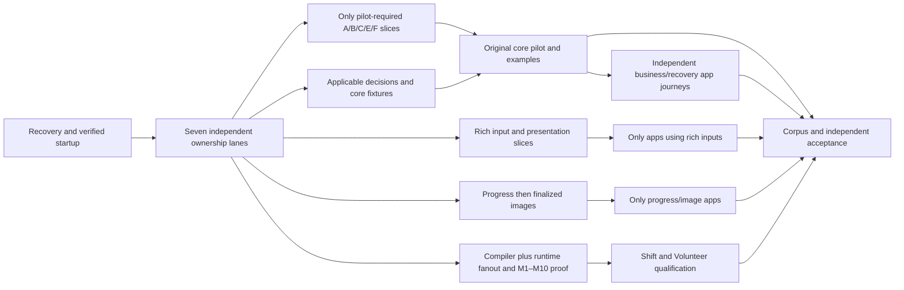

# Remaining CanLang implementation: seven parallel lanes

Status: **saved planning revision, 2026-10-06; implementation remains user-stopped.**
The user requested this reorganization after more than twelve hours of wall time.
This document does not authorize restarting the stopped Muse session or launching
replacement instances. Explicit human restart permission remains required.

Execution status, 2026-10-06 (coordinator 01a10f6d-4be0-7560-915d-a8bc1fefe571):
the quoted human START released the hold. Frozen base for all eight checkouts
is `b30d52a22516643533795f79d7d0fb111a6c0f04`; all 118 historical/checkpoint
commits are on `main`; seven lane worktrees exist on their recorded
`codex/remaining-lane-*` branches. Stopped-state/c82eb3c/dirty-work statements
above describe earlier planning and are superseded as scheduling facts only;
language decisions and acceptance requirements below remain authoritative.
Live progress: `implementation/challenge-audit-run/remaining-tasks.md`.

Preparation correction, 2026-10-06: the user cancelled preliminary worktree
allocation to resolve untracked files first. The three created A/B/C checkouts
were archived and removed; D–G were not created. See the
[unfinished-work checkpoint](challenge-audit-run/recovery-checkpoint.md).
Further allocation and implementation remain stopped pending user direction.

## Outcome and scope

Finish the existing challenge-audit scope through faithful, executable original
applications. Preserve the 41-task IDs, draft-first direction of fit, negative
witnesses, adopted decisions and independent acceptance requirements. Include
production gaps recorded behind historical completion ticks; do not repeat
already accepted slices or count mechanism tests as application completion.

Authoritative inputs:

- [Original design](CHALLENGE-AUDIT-PLAN.md), [historical execution checklist](challenge-audit-run/tasks.md)
  and [stopped runtime record](challenge-audit-run/monitor.md).
- [Fanout decision](challenge-audit-run/t33-resolution.md) and
  [F1–F8 implementation/proof plan](challenge-audit-run/evidence/t34-plan.md).
- [Description/reference design](DESCRIPTION-REFERENCE-PLAN.md) and
  [independent supplemental review](description-reference-run/review.md).

[OBSERVED] HEAD is `c82eb3c58ab192b809b398b20a5137357995b2d4`. The historical
checklist has **16 open T tasks and 25 ticked T tasks**. The open IDs are T04,
T15, T20, T22, T23, T26, T27, T29, T34, T35, T36, T37–T41. G1–G5, H01,
R01 and C01 remain open. The dead host's last 79% is not a completion estimate.

[OBSERVED] F6, F7 and T26 have dirty tracked/untracked implementation changes.
F7 was expressly released **ungated**; F6/T26 release and complete gates were
unresolved. F1–F5 are recorded committed. Other dirty content includes a separate
living-filetree revision, historical checklists and Codex review/monitor evidence;
these are not worker salvage payloads. A new worktree from HEAD would omit dirty
work. Preserve and attribute it before any future allocation.

[INFERRED] Seven package ownership boundaries permit genuine concurrent work.
The prior shared checkout, global directory lock and three-worker arrangement
introduced unnecessary serialization and contributed to deadlock. The revised
method isolates writers and mutable outputs and joins small accepted capabilities.
It does not promise a particular completion time: final scope depends on actual
application blockers and verification results.

## Future hierarchy and ownership

On separately authorized resumption, use **one dedicated Muse coordinator plus
seven separate Muse implementer CLI instances, each in its own worktree**.
This satisfies the user's more-than-four-lanes rule. Each implementer may use
its own native subagents within its runtime limit; that local limit is not a
global implementation cap. Seven ready editing lanes do not imply seven heavy
builds running at once.

Codex registers the coordinator's actual session ID first. Every implementer
prompt names that verified coordinator as the user-authorized task-scoped boss.
Directives remain bounded by this scope and human steering. Startup/communication
must be verified before edits; existing external-message failure is not silently
assumed repaired. The coordinator alone owns integration, central contracts,
central progress and cross-lane assignments. Codex owns monitoring and R01/C01.

After authorized recovery, establish one **central** continuation checklist at
`implementation/challenge-audit-run/remaining-tasks.md`, outside diverging lane
copies. Do not erase the original evidence/checkbox history. Lane status records
link their packet IDs and exact commits; only the coordinator updates central
progress. The original `tasks.md` is reconciled at integration/handoff, with
affected task acceptance explicitly revalidated. This document is the packet
backlog until that future checklist is created; no runtime roster exists yet.

For future execution this revision supersedes the historical checklist's
single-checkout, three-global-workers, no-worktrees and single-Muse-instance
restrictions. It does not supersede stopped-state/no-restart instructions,
language decisions, scope or review obligations. No old session is currently
being resumed, replaced, messaged or migrated.

| Lane | Exclusive code boundary | First ready assignment after recovery | Subsequent work |
| --- | --- | --- | --- |
| A — Compiler | `compiler/**` | Recover and verify F6 from its attributed dirty patch | T04/T15 emitted-contract joins, E6008 gaps, static T29, remaining T35 and example-emission defects |
| B — Core state | `packages/state/**`, `packages/values/**` | Close state-side defaults/receipt/read consumers using released existing contracts | Canonical T29 storage/authority, T04 rich-state compatibility, applicable fence/hook/restart proofs |
| C — Production runtime | `packages/cloudflare/**`, `packages/stdlib/**` | Recover and verify F7 independently of F6 completion | Production T18/T19/T25 wiring, read adoption, MCP registry and two deploy/boot 500 failures |
| D — Work/files/providers | `packages/work/**`, `packages/files/**`, `packages/services/**` | Recover and verify T26 | T27 image finalization, receipt re-pointing/mirror proofs, applicable bound-dispatch and F8 kernel defects |
| E — Interfaces/identity | `packages/interfaces/**`, `packages/identity/**` | Wire bound-input checking and MCP visibility/dispatch | HTTP/MCP authority parity, rich input and bracket-name seams, interface context/errors |
| F — Presentation | `packages/ui/**` | Implement T20b against committed T19 derivation | Rich widgets, null/datetime/reference handling, conflict/errors, client/exports and T08 UI parity |
| G — Fixtures/journeys | `packages/testkit/**`, `tests/e2e/**` | Adjudicate pilot-specific T36 fixture cases and provision unaffected core fixtures | T22/T23, T37–T40, F8 cross-package witnesses and T41 corpus evidence |

The coordinator owns `packages/contracts/**`, root manifests/build/CI configuration,
shared normative/design records and central evidence/checklists. It does not take
ownership of unrelated living-filetree edits. After an eventual merge the merge
handler reconciles that plan against its checkpoint, coordinating with its owner.

No lane edits another lane's package to finish a join. It supplies an exact
contract/consumer request. For example, F7's conditional work command belongs
to D; compiler example changes belong to A; HTTP context/error helpers belong
to E even when F needs them. ICU value implementation belongs to B while Rust
message analysis belongs to A. Draft corrections use a separately reserved writer after LG00 adjudication: exact
`draft/<app>.can` and only actually affected companion `.requirements.md`/`.mjs`
paths, one submodule writer, with commit/pointer provenance. G may investigate
read-only; it does not gain blanket draft-edit authority.

Shared contracts use short, independently versioned
handoffs, rather than one global T04 transaction blocking everything.

## Recovery gate: preserve unfinished work once

These are future tasks, conditional on explicit restart permission.

- [ ] **P00 — Attribute and preserve the stopped inputs.** Coordinator/Codex;
  record HEAD, branch, every tracked hunk/untracked test, prior writer/assignment,
  command/goal/session evidence and ownership disposition. Preserve recoverable
  content before edits. Do not sweep unrelated docs or another task's work into
  implementation commits. Dead process cessation is not a successful handoff.
- [ ] **P01 — Publish a reviewable recovery base and lane payloads.** Coordinator;
  distinguish accepted committed base from unverified checkpoint changes. Attribute
  F6 to A (`effects.rs`, `ir.rs`, `js.rs`, effects/codegen tests), F7 to C
  (`runtime/invoke.ts`, `worker/assembly.ts`, two fanout tests), and T26 to D
  (receipt/observation/recovery plus four tests). Recover contract hunks from
  `contracts/artifact.ts` and `contracts/work.ts` under coordinator ownership;
  verify their producer/consumer shape before publishing dependencies. A payload
  is preservation evidence, not acceptance. Record hashes and exact selected base
  for each worker; do not assume HEAD includes these patches.
- [ ] **P02 — Verify the coordinator and first worker communication.** Codex;
  actual ID/model/MAX/workspace/native goal, then bidirectional communication and
  exact recipient ACK naming coordinator, lane, assignment and plan version.
  Launch/register the other ready workers only after this first proof. A rejected
  send blocks its route immediately. File deposition alone is not delivery.
- [ ] **P03 — Publish per-worktree readiness.** Coordinator/Codex;
  exact code reservations, worktree-local workspace links/build outputs, capacity
  and command-grant route. Before implementation writes, verify a supported
  recurring five-minute wake route, exact owned timer handle and setup ACK. If
  neither native scheduling nor an owned timer through verified ingress works,
  startup is blocked; the 25-minute heartbeat is not a substitute. Register one
  writer per path within each checkout.
  Affected contracts/source inputs must be released before their consumers update.

Recovery inventory and common contract publication are short startup joins.
They are not permission to rerun every historical suite or wait for all rich
features before starting independent code, fixtures or expected-value authoring.

## Implementation packets and capability joins

All boxes start open; historical producer acceptance is an input, not proof of a
new join. Each packet handoff records exact commit, owning paths, input/output
contract, relevant positive/negative checks, command outcomes and writer/command
release. Cross-package API changes are published by the coordinator first.

| Packet | Owner / scope | Actual prerequisite | Observable acceptance |
| --- | --- | --- | --- |
| A1 | A: recovered T34/F6 | P01/P03; committed F1 and T18 release | Both `each=` spellings check/emit, original guards/body behavior preserved; unsupported forms and ordinary loop overflow remain rejected |
| A2 | A + coordinator: T04/T15, T19 lowering | Matching contract slice | Canonical recursive/provider descriptors and required decimal/default/delivery lowering are consumed; no hand-built replacement descriptors |
| A3 | A: T35 remaining packets | Each packet's actual producer | Named titles, request bindings and query/datetime ordering prove valid/invalid boundaries; retain delivered ICU/CRUD/payload fixes |
| A4 | A: T29 static rules | Adopted T28 | Canonical imported owners resolve with parent/team/lifetime/cycle negatives; unrelated metadata decisions do not gate this work |
| A5 | A + F: T08 parity | Bounded disputed-site adjudication | Compiler/UI agree in the same grant context; preserve safety negatives and fair opposing evidence |
| B1 | B: T18 state/scenario consumers | Existing T18 mechanism, matching descriptor slice | Defaults/server fields/parent/context/order/replay agree on CRUD and scenario paths; unsupported computed initialization stays explicit |
| B2 | B: T17/T04 reads and schema consumers | Published read/policy/type contract | Required filtered/owner/archived/policy reads execute canonically; denial/history/replay/restart proofs match claimed scope |
| B3 | B: T25 receipt/schema consumers | Matching A/coordinator receipt-schema output | Declared schemas replace interim hand-built schemas; current/stale receipt authorization and disclosure boundaries hold |
| B5 | B: T29 canonical containment | A4 matching static owner contract | Imported storage/team/lifetime/cycle boundaries hold; receipt production wiring does not wait for this unrelated packet |
| B4 | B + owning peers: T31/T32 review gaps | Specific hook/authority contract | Qualify applicable bounds, revocation/spend race and retry/recovery behavior; refinements or excluded capabilities retain explicit scope |
| C1 | C: recovered T34/F7 | P01/P03; committed F1–F5 | Atomic source+intent, durable fenced claim/record, first-attempt anchoring, fair scheduling and honest admission exhaustion; completed real gates |
| C2 | C: production T18/read joins | B1/B2 matching released slice | Actual generated Cloudflare invocation uses state/default/read behavior rather than earlier passthrough/refusal posture |
| C3 | C: production T19/T25 joins | Only the matching B3 receipt slice and E input/visibility slice | Actual registry/dispatch consumes checked inputs and receipt/schema ports; browser/MCP rules and real receipt paths agree |
| C4 | C: deployment/boot repair | Reproduce exact existing two 500 failures | Both failures repaired and real compiled boot/load/dispatch controls pass; no unsupported production deployment |
| D1 | D: recovered T26 | P01/P03; existing T25 contract | Per-relation duplicates/cancellation/late usage/terminal immutability/notifications and real durable restart qualified |
| D2 | D: T27 finalized images | Image-relevant D1 plus real file lifecycle | Receiving-app finalized file, ownership/provenance/permission/invalid output/replay execute through owning lifecycle |
| D3 | D: receipt/bound-dispatch follow-ups | Matching B3/C3/producer contracts | Re-pointing to existing receipt and mirror conformance work; admitted bound sends execute; unavailable Handbook capabilities stay explicit |
| E1 | E: T19 bound/MCP/interface dispatch | Committed derivation; matching published contract | Pure bound checker is actually invoked; binding visibility and equal-authority inputs are preserved through dispatch |
| E2 | E: T20 HTTP/error/context seams | Matching F request and operation contract | Bracket names, CSRF/context, safe errors and full/partial request path agree with dispatcher; no parallel validation engine |
| F1 | F: T20b rich presentation | Committed T19 descriptors, incremental E handoffs | Delivery/decimal/file/bound/datetime/null/reference/conflict behavior plus client/exports execute; negative tampering and authority cases retained |
| LG00 | G + reserved draft/design owner: all T36 residual cases | Fresh site evidence and applicable repaired roots; prioritize pilot cases | Adjudicate the complete collision/cycle/trusted-selector/handler/fixture-parent/secret/cardinality inventory with intent, opposite case and confidence; only demonstrated corrections under exact reservations; preserve unresolved proposals and negatives |
| LG01 | G: T22a core fixtures | Only selected fixture decisions from LG00 plus required released producer slices | Core model/user/grant fixtures validate; setup failure cannot satisfy an expected business rejection; independent expectations preserved |
| LG02 | G: T22b/c and T23 | Matching fixture/provider/file output | Rich fixtures and compiled tables/sequences execute actual callers/prior commits/observations; deliberately broken expectation fails |
| LG03 | G + C/E/F: T37 basic pilot | Its own source blockers, core LG01/LG02 and required production/UI/MCP slices | One unchanged original app proves two actors, denied read, persistence, stale update, replay, browser/MCP parity and genuine examples |
| LG04 | G + A/B/C/D: T34/F8 | A1, C1 and actual required authority/fixture joins | Full M1–M10 matrix, including 499/500/501/1000, crash boundaries, duplicates, insert/move/delete, rejection/revocation isolation, exhaustion, fairness, two occurrences, unchanged Shift/Volunteer and all negatives |
| LG05 | G + affected producers: T38/T39/T40 | Reusable LG03 harness; each app's own capabilities | Qualify Expense/Leave/Onboard, Approve/Grant/Mail/Sync, Chat, Creative/Gallery and Shift/Volunteer independently; no unrelated all-app gate |
| LG06 | G + coordinator: T41 | Repaired roots + qualification needed for advertised scope | Fresh source-built 52-source corpus, per-app dispositions, negatives and real runtime evidence; exact supported/deferred scope without false total completion |

Important dependency corrections:

- A1/F6 needs F1 and released T18; it does **not** wait for F1–F5 completion.
  C1/F7 uses F1–F5; it does **not** wait for F6 to implement its runtime mechanism.
  Actual source qualification/F8 needs both accepted compiler and runtime paths.
- Current Shift/Volunteer cohort parents are package-local. T29 is not a global
  fanout gate; it joins only workflows actually using imported containment.
- LG01/T22a waits for applicable fixture decisions, not all T36. G can author
  independent expectations and provision unaffected fixtures immediately.
- Core pilot qualification does not wait for rich providers, image finalization
  or fanout when its original source does not use them.
- A full parent contract is not a universal prerequisite when a relevant released
  slice is sufficient. Record exact slice/base, and revalidate its real consumer.
- LG05 app families are parallel qualification packets. Chat need not wait for
  Creative/Gallery images; ordinary business apps need not wait for Shift fanout.

## Execution waves and integration order

1. **Recovery/readiness:** P00–P03, preserving unaccepted work and proving the
   first communication route. No launch occurs under this planning request.
2. **Seven-way production work:** A1/A2, B1/B2, C1/C4, D1, E1, F1 and LG01 can
   proceed on their released inputs. Each lane pursues another ready packet if
   one exact consumer input is pending; it does not hold a build grant while waiting.
3. **Rolling joins:** coordinator accepts small exact handoffs, publishes matching
   contracts, integrates providers before their consumers and immediately dispatches
   available C2/C3, B3, D2/D3 and LG02/LG03. Newly discovered source/emission defects
   route to the owning lane, never to a parallel writer of the same boundary.
4. **Parallel original journeys:** basic pilot, business workflows, receipt recovery,
   progress/image apps and fanout proofs proceed according to their own prerequisites.
   F8 joins A/B/C/D/G; producer tests alone do not qualify original apps.
5. **Release acceptance:** LG06/T41, coordinator historical G1–G5 gate evidence and H01, then
   Codex R01 with focused repairs, D closure bookkeeping and C01.

Arrows denote required released capability slices, not whole-lane completion.
Fanout proof still joins A/B/C/D/G, while basic fixtures and pilot work do not
wait for rich forms, images or fanout.

Integration is a coordinator duty, not an eighth overlapping package writer.
Cherry-pick/merge only exact released commits under future implementation
authorization. Contract changes are small and versioned; each consumer names the
accepted version. Avoid synchronized root rebuilds after every edit. Independent
acceptance tests the integrated revision, not a mixture of workers' private outputs.

## Deadlock prevention and bounded machine use

The revised command protocol has **no root or run-directory `.heavy-lock`**.
Workers do not acquire/delete sibling locks, nest command grants, or hold resources
while editing, waiting on dependencies or polling. Existing stale directories are
preserved as stopped-run evidence until separately authorized, owned recovery.

Every worktree has private `dist`, `.tsbuildinfo`, workspace links, fixture storage
and other mutable outputs. Rust targets are private to actual Rust builders.
Reuse immutable dependency/download stores where supported; do not point local
`@canlang` workspace links or mutable output at the original checkout. Provisioning
must verify the actual package-manager behavior rather than inventing flags.

[OBSERVED] The planning read reports **19 GiB disk free**. Seven copies of the
historical 3.2 GiB Rust target would exceed that capacity. Only A needs a worker
Rust target; integration may use its own existing cache when exclusively owned.
Other lanes build their owning TypeScript boundaries. Keep a 10 GiB free-space
floor for new allocations and preserve shared caches, swap and other tasks' files.

The coordinator schedules resource-hungry commands with explicit **command-scoped
grants**, not directory locks. Initially allow one Rust compilation and one
isolated TypeScript/durable build concurrently; lightweight isolated checks and
editing continue independently. Recalibrate expensive-command capacity from
observed peak memory, memory pressure, disk and command duration. This is an
initial resource envelope, not another global three-worker rule.

A grant records ID, session/owner/worktree, exact command, dependencies, resource
class, launch deadline, actual handle/PID/start, last observation and release.
Use a two-step launch handshake: worker sends `READY_TO_START`; coordinator
reserves capacity and returns exact `START_ACK`; only then may execution begin.
Acknowledged capacity remains reserved until launch failure or command cessation
is verified. Reclaim even an expired unlaunched grant only after the owner's
cancellation ACK or verified owner/process cessation. A missing ACK is
`blocked-communication`, not free capacity. Never replace a running command
merely because its estimate expired. Integration/full-suite commands receive
explicit slots; workers retain scoped checks and useful edits.

Persist one coordinator-owned grant ledger. Before recovery/replacement, reconcile
all recorded owners/command process trees and reserved capacity. Lost coordinator
identity or communication prevents new expensive-command launches while existing
commands remain accounted for. Register and acknowledge any authorized replacement;
a second coordinator must never allocate from a fresh empty ledger.

Required states are `editing`, `command-running`, `awaiting-grant`,
`awaiting-specific-input`, `blocked-communication`, `released-ungated`,
`released-verified`, `integrated` and `accepted`. “Working” or a live TUI is not
sufficient evidence of execution. A status claiming a running suite with no
matching process is a contradiction to investigate immediately. Two unchanged
inspections require a bounded diagnosis and a stated next action. Low CPU alone
does not prove deadlock. Waiting workers never sit in shell sleep-retry loops.

## Supervision, evidence and closure

Upon future authorized startup, reconcile any saved owned timer before creating
a replacement, and prove one owned **five-minute coordinator timer**
checking every registered lane, its actual command process tree, overdue handles,
message ACKs and dependency readiness. Record timer handle/setup ACK before releasing implementation writes, and verify
the first actual received wake later. Discover the installed runtime's actual
schema. If native scheduling is absent, an owned background timer is permitted
only through already verified ingress, with PID/start identity, exact target,
bounded delivery, stop handle and no duplicated pending wakes. If neither route
works, record startup blocked rather than falling back to heartbeat-only checks. Handle delivered failures/completions
immediately. Inspect long commands every one-to-five minutes, default two, from
their last check; wakes do not reset deadlines or create duplicate commands.

Codex's separate **25-minute same-chat supervision** checks real identity/process,
timer receipt and task evidence. The existing heartbeat remains paused now.
No restart/replacement or timer activation follows from saving this plan.

Before any worktree/resource allocation, register ownership/cleanup in a Codex
runtime roster. Preserve actual session/native-goal IDs, base and dirty payload,
PID/start, tmux coordinates, startup ACKs, verified communication route, command
grants, timer/wake evidence and viewer links. Test bidirectional delivery before
releasing writes. A rejected send is blocked; accepted-but-unacknowledged is
pending. An atomic mailbox is usable only with supported recurring inbox reads
and exact authenticated-recipient ACKs. Do not evade receiver safety rejection.

Each lane completes only after exact released handoff, relevant acceptance and
explicit coordinator acceptance/native goal-completion acknowledgment. An accepted
lane can remain idle for bounded repairs; it does not repeatedly run clean checks
while waiting for parent review. Overall progress reflects accepted/integrated
packets and app gates, not native percentage or code volume.

- [ ] **I00 — Close the T04 compatibility/consumer matrix.** Coordinator with
  A/B/C/D/E/F handoffs; explicitly map rich/nested/date/duration/union/default
  schemas, providers, generated policies, hooks/invariants/locks and file/progress
  extensions to defining contract and actual consumer. Record version compatibility
  and positive/negative witnesses. Missing mandatory joins keep T04 open;
  individual descriptor or mechanism packets do not close this parent.
- [ ] **I01 — Record historical G1–G5 and H01 from integrated evidence.** Coordinator;
  source/checker/descriptors, canonical durable core, real pilot/work/authority,
  per-app journeys and corpus claims; all affected writers/reservations/commands
  released. Preserve unsupported mandatory workflows as blockers.
- [ ] **R01 — Independent Codex acceptance.** Review actual integrated diffs and
  independently probe critical invariants. Preserve T08 metadata-grant parity,
  E4012's separate context, actual T18/T19/T25 production joins, T16/T17 limits,
  deployment failures, hook/fence/recovery limits and complete fanout matrix.
  Route concrete repairs through the verified coordinator; passing worker tests
  or historical parent ticks are insufficient.
- [ ] **D-CLOSE — Close the accepted description/reference supplement.** Preserve
  all six independently resolved findings and evidence, annotate superseded
  historical locale observations, reconcile bookkeeping/native handoff and exact
  owned thin resources. Localized MCP, artifact migration, AI guides, automatic
  translation and public publication remain outside first-reference acceptance.
- [ ] **C01 — Preserve evidence and close owned resources.** Stop exact owned
  timers after acceptance, preserve unique/uncommitted work, clean only released
  owned worktrees/caches/prompts and retain attached viewers with a recorded
  cleanup owner. Retire the matching heartbeat only after no follow-up remains.

No new language adoption is smuggled into scheduling. Handbook execution,
cross-store atomicity, hook send/emit expansion, admission-age rules and other
explicit exclusions/refinements keep their recorded status. Any material language
decision uses verified draft context and the repository's three equivalent JEV
consultations, with uncertainty and opposing evidence; only dependent work waits.

## Planning verification

Performed: read-only checklist/design/runtime/source-path/Git status/disk survey;
two independent read-only schedule/operations reviews; coverage of all 16 open
task IDs, interrupted F6/F7/T26 and completed-parent integration gaps. The reviews
confirmed the F6/F7 split and fixture-specific T36 gating, exposed contract/file
collisions and rejected repeating the directory-lock arrangement.

Not performed: implementation tests/builds, source changes, commits, branches,
worktrees, process/timer changes or Muse startup. Saving this plan changes none
of the stopped runtime's acceptance, native goals or restart permission.
